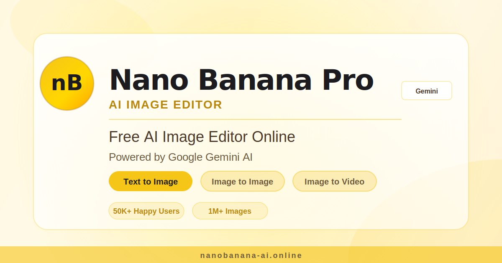

# Nano Banana Pro AI MCP Server

> Nano Banana Pro AI Image Editor Free Online by Gemini AI

[](https://lobehub.com/mcp/rocnubie-nanobanana-mcp)
[](https://nodejs.org)
[](#installation)
[](./LICENSE)
[](#tools)
[](https://modelcontextprotocol.io/specification)
[](https://modelcontextprotocol.io)

<p align="center"><a href="https://nanobanana-ai.online"></a></p>

A Model Context Protocol server that exposes the canonical Nano Banana Pro AI knowledge surface — image generation workflows and styles, pricing, FAQ, official links — to MCP-compatible AI clients such as Claude Desktop, Cursor, Windsurf, and Continue. Read-only, no API keys, no quota, ~50 ms cold start.

Official website: https://nanobanana-ai.online

## 🎨 About Nano Banana Pro AI

Nano Banana Pro AI is an online image and video editing platform that uses multiple AI models to handle visual tasks that would otherwise require dedicated design software or manual effort. Users can generate images from text prompts, remove or swap backgrounds, erase unwanted objects, enhance photo quality, and convert still images into short video clips — all through a browser-based interface. The platform draws on models including Flux, GPT Image, Ideogram, and Kling, and covers more than 60 specialized tools across image and video workflows. New accounts receive 55 free credits with no watermarks on outputs, making it straightforward to evaluate before committing to a paid plan.

## Key Features

- **Text-to-image generation** using multiple AI models (Flux, GPT Image, Ideogram, and others), with results delivered in 5 to 30 seconds
- **Background removal and replacement** with AI-assisted precision, supporting JPG, PNG, and WEBP uploads
- **Smart object removal** that fills in the erased area to produce a clean, natural result
- **Image-to-video conversion** that animates a still photo into an MP4 clip, typically within one to five minutes
- **Batch processing** for applying consistent edits across multiple images in a single pass
- **AI photo enhancement** covering quality upscaling, lighting correction, and color grading, with output up to 4K resolution

## Use Cases

- An e-commerce seller shoots product photos on a cluttered table and uses background removal plus replacement to produce clean, studio-style listings
- A social media manager generates on-brand visuals from text prompts rather than sourcing stock photography or briefing a designer
- A photographer uses the batch enhancement tool to apply consistent color grading across an entire shoot before delivery
- A marketer animates a product image into a short video clip for use in ads without commissioning video production
- A small business owner removes distracting elements from existing brand photos without reopening the original files in editing software

## Who Is It For

Nano Banana Pro AI is built for people who need professional-looking visual content but do not have the time, budget, or training to work with traditional editing software. E-commerce sellers and product photographers will find the background tools and batch workflows particularly practical. Marketing teams and content creators benefit from fast text-to-image generation and the ability to animate stills into video. The credit-based pricing model keeps entry costs low for occasional users, while paid plans that include commercial usage rights suit agencies and businesses producing content at scale. No prior design experience is required to use any of the tools.

## Tools

### `list_styles`
Return the canonical list of image-generation styles or presets the site exposes. (Nano Banana Pro AI)

_Input:_ no parameters. _Returns:_ text/markdown.

### `get_pricing`
Return the canonical pricing entry point for Nano Banana Pro AI.

_Input:_ no parameters. _Returns:_ text/markdown.

### `get_official_links`
Return the canonical list of official links for Nano Banana Pro AI (website, support, docs when available).

_Input:_ no parameters. _Returns:_ text/markdown.

## Resources

- `site://nanobanana/styles` — Supported image-generation styles and presets.
- `site://nanobanana/pricing` — Canonical pricing entry point.
- `site://nanobanana/faq` — Short FAQ generated from public site metadata.
- `site://nanobanana/links` — Canonical URLs to share with users.

## Prompts

### `tell_me_about_nanobanana`
Summarize what the site is, who it's for, and how it works. — Nano Banana Pro AI

### `try_image_style_nanobanana`
Recommend a starting image-generation style for a stated goal. — Nano Banana Pro AI

## Installation

### Install via Smithery

```bash
npx -y @smithery/cli install nanobanana-mcp --client claude
```

(Replace `claude` with `cursor`, `windsurf`, or `continue` for those clients.)

### Install from source

```bash
git clone https://github.com/rocnubie/nanobanana-mcp.git
cd nanobanana-mcp
pnpm install
```

Then add to your MCP client config (`claude_desktop_config.json` for Claude Desktop, `mcp.json` for Cursor / Windsurf / Continue):

```json
{
  "mcpServers": {
    "nanobanana-mcp": {
      "command": "node",
      "args": [
        "/absolute/path/to/nanobanana-mcp/src/index.mjs"
      ]
    }
  }
}
```

### Debug with MCP Inspector

```bash
npx @modelcontextprotocol/inspector node src/index.mjs
```

## Official Links

- Website: https://nanobanana-ai.online
- Pricing: https://nanobanana-ai.online/pricing
- Support: support@nanobanana-ai.online

## Development

```bash
pnpm install
pnpm start                 # run the server over stdio
```

## License

MIT
