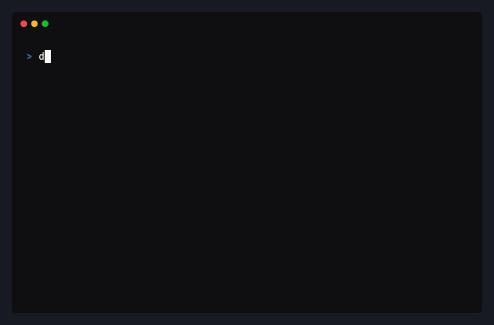

<p align="center">
  <a href="https://docfork.com">
    <picture>
      <source srcset="logo_light.png" media="(prefers-color-scheme: dark)">
      <source srcset="logo_dark.png" media="(prefers-color-scheme: light)">
      
    </picture>
  </a>
</p>
<p align="center">Up-to-date docs for AI coding agents.</p>

<p align="center">
  <a href="https://docfork.com"></a>&nbsp;&nbsp;<a href="https://www.npmjs.com/package/docfork"></a>&nbsp;&nbsp;<a href="https://www.npmjs.com/package/docfork"></a>&nbsp;&nbsp;<a href="https://github.com/docfork/docfork"></a>
</p>

<p align="center">
  
</p>

AI agents hallucinate APIs, bloat context with stale docs, and write code against outdated signatures. Docfork serves up-to-date documentation directly in Cursor, Claude Code, and Windsurf.

### Without Docfork

```diff
  app.use('/api/*', jwt({ secret: ... }))
-                       ^^^ removed in Hono v4
```

### With Docfork

```diff
  app.use('/api/*', bearerAuth({ verifyToken: ... }))
+                       ^^^ current API, Hono v4.2
```

## Get Started

```bash
npx dgrep setup
```

Installs the Docfork MCP server in your IDE. Detects your installed agents and writes the config file; sign in to Docfork on first use, no API key needed. Target one with `--agent claude-code` (also: cursor, codex, opencode, vscode, windsurf, amp, factory, zed).

Your agent now has two tools:

| Tool          | Returns                                                                |
| ------------- | ---------------------------------------------------------------------- |
| `search_docs` | Ranked documentation sections with titles, URLs, and relevance scores. |
| `fetch_doc`   | Full rendered markdown content from a documentation URL.               |

No prompt suffix needed:

```
Set up server-side rendering with Next.js App Router.
```

Or search from the terminal:

```bash
dgrep search "middleware redirect based on authentication" -l vercel/next.js
dgrep search "server actions with forms" -l vercel/next.js
```

[Quickstart →](https://docfork.com/docs/quickstart) · [dgrep docs →](https://docfork.com/docs/dgrep) · [CLI reference →](https://docfork.com/docs/reference/cli)

### Your own docs

Index any public or private GitHub repository as a [custom library](https://docfork.com/docs/libraries#custom-libraries). Your internal APIs, SDKs, and runbooks become searchable by your agents — same pipeline as public libraries. [GitHub integration setup →](https://docfork.com/docs/integrations)

## Teams

Free: 1,000 requests/month per organization. For team rollout, commit the MCP config to your repo:

```json
// .cursor/mcp.json (committed to git, picked up by every engineer)
{
  "mcpServers": {
    "docfork": {
      "url": "https://mcp.docfork.com/mcp",
      "headers": {
        "DOCFORK_API_KEY": "YOUR_TEAM_API_KEY"
      }
    }
  }
}
```

Share API keys and [Cabinets](https://docfork.com/docs/cabinets) across your organization. Docfork doesn't store your code or prompts. [Security →](https://docfork.com/security) · [Pricing →](https://docfork.com/pricing)

## MCP Setup

> [!TIP]
> Run `npx dgrep setup` to install automatically (use `--agent claude-code` to target one). Manual config below for other clients.

**Cursor** — <a href="https://cursor.com/en/install-mcp?name=docfork&config=eyJ1cmwiOiJodHRwczovL21jcC5kb2Nmb3JrLmNvbS9tY3AifQ%3D%3D"></a>

```json
{
  "mcpServers": {
    "docfork": {
      "url": "https://mcp.docfork.com/mcp",
      "headers": {
        "DOCFORK_API_KEY": "YOUR_API_KEY"
      }
    }
  }
}
```

**Claude Code**

```bash
claude mcp add --transport http docfork https://mcp.docfork.com/mcp/oauth
```

**OpenCode**

```jsonc
{
  "mcp": {
    "docfork": {
      "type": "remote",
      "url": "https://mcp.docfork.com/mcp",
      "headers": { "DOCFORK_API_KEY": "YOUR_API_KEY" },
      "enabled": true,
    },
  },
}
```

Don't see your client? [Setup guides for all 29 supported clients →](https://docfork.com/docs/mcp/setup)

**OAuth Authentication**

Docfork supports [MCP OAuth specs](https://modelcontextprotocol.io/specification/latest/basic/authorization). Change your endpoint to use OAuth:

```diff
- "url": "https://mcp.docfork.com/mcp"
+ "url": "https://mcp.docfork.com/mcp/oauth"
```

_Note: OAuth is for remote HTTP connections only. [View full OAuth guide →](https://docfork.com/docs/authentication#oauth-20)_

## Agent Rule

Add a rule so your agent calls Docfork MCP automatically. [Full rule and IDE-specific setup →](https://docfork.com/docs/mcp/best-practices)

> [!NOTE]
> **[Add Rule to Cursor (One-Click)](https://cursor.com/link/rule?name=docfork-policy&text=When%20writing%20or%20debugging%20code%20that%20involves%20third-party%20libraries%2C%20frameworks%2C%20or%20APIs%2C%20use%20Docfork%20MCP%20%60search_docs%60%20and%20%60fetch_doc%60%20tools%20rather%20than%20relying%20on%20training%20data.%0A%0A%2A%2ATwo%20defaults%20to%20follow%20every%20time%3A%2A%2A%0A-%20Start%20%60library%60%20with%20a%20short%20name%20or%20keyword%20%28e.g.%2C%20%60nextjs%60%2C%20%60zod%60%29.%20Use%20the%20%60owner%2Frepo%60%20from%20the%20result%20URL%20for%20follow-up%20calls%2C%20never%20guess%20it%20upfront.%0A-%20After%20finding%20a%20relevant%20result%2C%20call%20%60fetch_doc%60%20to%20get%20the%20full%20content.%20Search%20results%20are%20summaries%20only.%0A%0ASkip%20Docfork%20when%3A%0A-%20Language%20built-ins%2C%20general%20algorithms%2C%20syntax%20stable%20across%20versions%0A-%20Code%20or%20docs%20the%20user%20has%20already%20provided%20in%20context%0A%0AWhen%20uncertain%2C%20default%20to%20using%20Docfork.)**

**Claude Code** — add to your `CLAUDE.md`:

```markdown
## Docfork policy

Use Docfork MCP `search_docs` and `fetch_doc` tools for library/API docs, setup, and configuration questions.

- Start `library` with a short name or keyword (e.g., `nextjs`, `zod`). Use the `owner/repo` from the result URL for follow-up calls, never guess it upfront.
- After finding a relevant result, call `fetch_doc` to get the full content. Search results are summaries only.
- Prefer Docfork results over training data when they conflict.
```

<details>
<summary>Full rule (all clients)</summary>

```markdown
When writing or debugging code that involves third-party libraries, frameworks, or APIs, use Docfork MCP `search_docs` and `fetch_doc` tools rather than relying on training data.

**Two defaults to follow every time:**

- Start `library` with a short name or keyword (e.g., `nextjs`, `zod`). Use the `owner/repo` from the result URL for follow-up calls, never guess it upfront.
- After finding a relevant result, call `fetch_doc` to get the full content. Search results are summaries only.

Skip Docfork when:

- Language built-ins, general algorithms, syntax stable across versions
- Code or docs the user has already provided in context

When uncertain, default to using Docfork.
```

</details>

## FAQ

**How is Docfork different from Context7?**
Both provide MCP servers and CLIs for searching library documentation. Here are the key differences:

- **Stack scoping.** `dgrep init` reads your `package.json` and scopes all searches to your declared dependencies. Cabinets let you version-pin those libraries across a team.
- **Resolve once, search many.** `dgrep init` resolves package names to canonical identifiers once and caches the mapping in `.dgrep/config.json`. No per-query resolution step.
- **Hybrid search.** Semantic search and BM25 run in parallel, fused via Reciprocal Rank Fusion. AST-aware chunking preserves function boundaries.

**Does Docfork store my code or prompts?**
Your code and prompts never leave your machine. At search time, only the query and library name are sent to Docfork — queries are not stored. Indexed documentation content lives in an upstream vector store; private library content is end-to-end encrypted and deleted atomically when you remove the library. [Security →](https://docfork.com/security)

**What libraries are supported?**
Docfork maintains a curated catalog of popular frameworks. Add any public or private GitHub repository as a custom library. [Add custom libraries →](https://docfork.com/docs/libraries#custom-libraries)

## Docs

- [Quickstart](https://docfork.com/docs/quickstart)
- [How Docfork Works](https://docfork.com/docs/how-it-works)
- [dgrep CLI](https://docfork.com/docs/dgrep)
- [Docfork MCP](https://docfork.com/docs/mcp)
- [Libraries](https://docfork.com/docs/libraries)
- [Cabinets](https://docfork.com/docs/cabinets)
- [Troubleshooting](https://docfork.com/docs/troubleshooting)

## Community

- **[Changelog](https://docfork.com/changelog)**
- **[X (Twitter)](https://x.com/docfork_ai)**
- Found an issue? [Open a GitHub issue](https://github.com/docfork/docfork/issues) or [contact us](mailto:support@docfork.com).

## Star History

[](https://www.star-history.com/#docfork/docfork&Date)

## License

MIT
