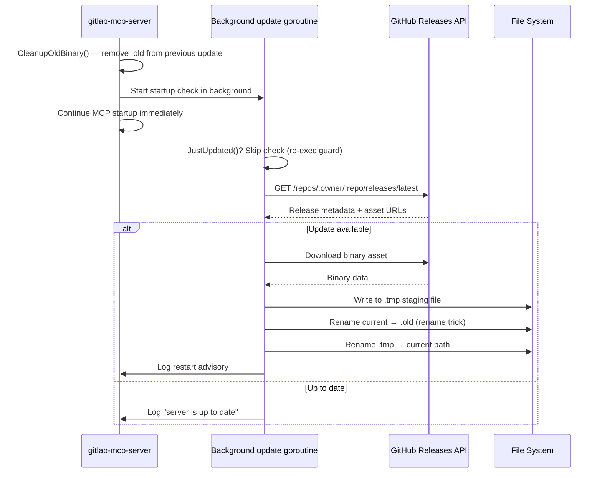
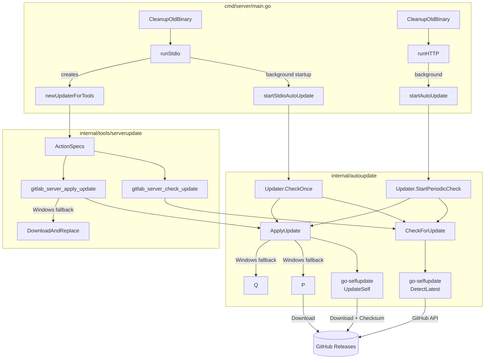

# Auto-Update

gitlab-mcp-server can automatically detect, download, and apply new releases from a GitHub repository. Updates are fetched from the GitHub Releases API, validated with a `checksums.txt` file, and applied using a **rename trick** — the running binary is renamed to `.old` and the new binary is placed at the original path. The running MCP process keeps serving; restart it to use the new binary. Old `.old` files are cleaned up automatically at startup.

> **Diátaxis type**: Explanation
> **Audience**: 👤🔧 All users
> **Prerequisites**: gitlab-mcp-server installed, GitHub repository with releases
> 📖 **User documentation**: See the [Auto-update](https://jmrplens.github.io/gitlab-mcp-server/operations/auto-update/) on the documentation site for a user-friendly version.

---

## How It Works



The update mechanism uses [creativeprojects/go-selfupdate](https://github.com/creativeprojects/go-selfupdate) v1.5.2 with a GitHub source backend. Key properties:

- **GitHub Releases**: Auto-update fetches releases from the GitHub repository configured via `AUTO_UPDATE_REPO` (default: `jmrplens/gitlab-mcp-server`).
- **Rename trick**: The running binary is renamed to `.old` (allowed even on Windows where executables are locked), and the new binary is placed at the original path. This eliminates the need for deferred scripts or manual intervention.
- **Non-blocking stdio startup**: In stdio mode, release detection and downloads run in a background goroutine so MCP tool negotiation is not delayed by update I/O.
- **Next-restart activation**: The new binary is ready at the original path after a successful background update. The current MCP process keeps running the old code until it is restarted.
- **External updater integration (`--shutdown`)**: An external store app (pe-agnostic-store) can invoke `gitlab-mcp-server --shutdown` to terminate all running instances before replacing the binary on disk. This flag finds matching processes by name, sends a graceful termination signal, waits up to 5 seconds, and force-kills any remaining. Uses [gopsutil](https://github.com/shirou/gopsutil) for cross-platform process listing (Linux, macOS, Windows). No admin/root permissions required.
- **Re-exec loop prevention**: The legacy pre-start flow uses the `MCP_JUST_UPDATED=1` environment variable before re-exec and clears it on the new process startup, preventing infinite update loops.
- **Old binary cleanup**: At startup, `CleanupOldBinary()` removes any leftover `.old` file from a previous update.
- **Checksum validation**: Each release must include a `checksums.txt` asset (goreleaser format) containing SHA-256 hashes for all platform binaries.
- **Platform detection**: The library automatically selects the correct binary for the running OS and architecture (`{name}-{goos}-{goarch}`).

## Update Modes

The `AUTO_UPDATE` variable controls behaviour:

| Value            | Mode       | Behaviour                                             |
| ---------------- | ---------- | ----------------------------------------------------- |
| `true` (default) | Auto       | Detect and apply updates automatically                |
| `check`          | Check-only | Detect updates and log availability, but do not apply |
| `false`          | Disabled   | Skip all update checks entirely                       |

Accepted aliases: `1`/`yes` for true, `0`/`no` for false. The value is case-insensitive.

## Transport-Specific Behaviour

### Stdio Mode

When running as a stdio server (the default), auto-update runs as a **background startup check** with a configurable timeout (default: 60 seconds). The check is scheduled during startup, but MCP server construction and stdio transport startup continue immediately:

1. `CleanupOldBinary()` — remove leftover `.old` file from a previous update.
2. Parse `AUTO_UPDATE` mode from environment variables.
3. Check `MCP_JUST_UPDATED` — if set, skip the update check (re-exec guard) and clear the variable.
4. Launch the startup update check in a goroutine using `AUTO_UPDATE_TIMEOUT`.
5. Continue with normal MCP server startup without waiting for release detection or downloads.
6. In the background goroutine:
    - If mode is `true` and a newer release exists → download and apply it, then log a restart advisory.
    - If mode is `check` → log the available version without applying.
    - If no update is available → log that the server is up to date.

The startup check is **non-blocking and non-fatal**: any error (network timeout, invalid token, missing releases) is logged as a warning and does not prevent the server from starting or accepting MCP requests.

```text
INFO autoupdate: server is up to date  version=1.1.7
```

or (background update applied):

```text
INFO autoupdate: starting startup check in background  mode=true repository=jmrplens/gitlab-mcp-server current_version=1.1.7
INFO starting MCP server  transport=stdio version=1.1.7
INFO autoupdate: new version available  current_version=1.1.7 latest_version=1.2.0
INFO autoupdate: update applied  new_version=1.2.0
INFO autoupdate: binary updated in background — restart the server to use the new version  new_version=1.2.0
```

### HTTP Mode

When running as an HTTP server (`--http`), auto-update runs as a **background periodic check**:

1. Parse `--auto-update` flag (defaults to `true`).
2. Create an `Updater` with the GitHub source, `--auto-update-repo`, and `--auto-update-interval`.
3. Launch `StartPeriodicCheck()` — a goroutine that runs every `--auto-update-interval` (default: 1 hour).
4. Each cycle:
   - Check for a newer release (30-second timeout per check).
   - If mode is `true` → apply the update and log a restart advisory.
   - If mode is `check` → log availability only.
5. The goroutine stops when the server context is cancelled (graceful shutdown).

> **Note**: Auto-update uses the GitHub Releases API, completely independent of the user's GitLab configuration.

## Configuration Reference

### Environment Variables (Stdio Mode)

| Variable               | Default                      | Description                                                  |
| ---------------------- | ---------------------------- | ------------------------------------------------------------ |
| `AUTO_UPDATE`          | `true`                       | Update mode: `true`, `check`, or `false`                     |
| `AUTO_UPDATE_REPO`     | `jmrplens/gitlab-mcp-server` | GitHub repository slug (owner/repo) for release assets       |
| `AUTO_UPDATE_INTERVAL` | `1h`                         | Check interval (used by HTTP mode periodic checks)           |
| `AUTO_UPDATE_TIMEOUT`  | `60s`                        | Timeout for startup/background update checks (range: 5s–10m) |

Auto-update uses the GitHub Releases API via `AUTO_UPDATE_REPO`. It does **not** use the user's `GITLAB_URL`, `GITLAB_TOKEN`, or `GITLAB_SKIP_TLS_VERIFY`.

### CLI Flags (HTTP Mode)

| Flag                     | Default                      | Description                                                  |
| ------------------------ | ---------------------------- | ------------------------------------------------------------ |
| `--auto-update`          | `true`                       | Update mode: `true`, `check`, or `false`                     |
| `--auto-update-repo`     | `jmrplens/gitlab-mcp-server` | GitHub repository slug (owner/repo) for release assets       |
| `--auto-update-interval` | `1h`                         | Interval between periodic update checks                      |
| `--auto-update-timeout`  | `60s`                        | Timeout for startup/background update checks (range: 5s–10m) |

Auto-update uses the GitHub Releases API, so `--gitlab-url` and `--skip-tls-verify` do **not** affect auto-update behaviour.

### Configuration Examples

Disable auto-update entirely:

```env
AUTO_UPDATE=false
```

Check-only mode (log available updates without applying):

```env
AUTO_UPDATE=check
```

Custom repository and fast check interval:

```env
AUTO_UPDATE=true
AUTO_UPDATE_REPO=my-group/my-project
AUTO_UPDATE_INTERVAL=15m
```

Increase the download timeout for slow connections:

```env
AUTO_UPDATE_TIMEOUT=120s
```

HTTP mode with custom settings:

```bash
gitlab-mcp-server --http \
  --gitlab-url=https://gitlab.example.com \
  --auto-update=check \
  --auto-update-interval=30m
```

## MCP Tools

When auto-update is enabled, update tools are registered as part of the `gitlab_server` meta-tool (or as individual tools in non-meta mode). These allow AI assistants to check for and apply updates on demand:

### `gitlab_server_check_update`

Check if a newer version of the MCP server is available.

**Input**: None (empty object `{}`).

**Output**:

| Field              | Type    | Description                           |
| ------------------ | ------- | ------------------------------------- |
| `update_available` | boolean | Whether a newer version exists        |
| `current_version`  | string  | Currently running version             |
| `latest_version`   | string  | Latest release version (if available) |
| `release_url`      | string  | URL to the release page               |
| `release_notes`    | string  | Release notes content                 |
| `mode`             | string  | Current auto-update mode              |

**Annotations**: Read-only (`readOnlyHint: true`, `idempotentHint: true`).

**Example response** (Markdown):

```markdown
## ⬆️ Update Available

- **Current Version**: 1.1.7
- **Latest Version**: 1.2.0
- **Release URL**: https://github.com/jmrplens/gitlab-mcp-server/releases/tag/v1.2.0

### Release Notes

- Added new pipeline tools
- Fixed merge request approval handling
```

### `gitlab_server_apply_update`

Download and apply the latest MCP server update. The binary is replaced using the rename trick (rename current → `.old`, place new binary at original path). On all platforms a server restart is required to use the new version.

**Input**: None (empty object `{}`).

**Output**:

| Field              | Type    | Description                                              |
| ------------------ | ------- | -------------------------------------------------------- |
| `applied`          | boolean | Whether the update was applied (binary replaced on disk) |
| `previous_version` | string  | Version before the update                                |
| `new_version`      | string  | Version after applying the update                        |
| `message`          | string  | Human-readable status message                            |

**Annotations**: Destructive (`destructiveHint: true`) — replaces the server binary.

**Example response** (Markdown):

```markdown
## ✅ Update Applied

- **Previous Version**: 1.1.7
- **New Version**: 1.2.0

> **Note**: Restart the server to use the new version.
```

> **Important**: These tools are only registered when auto-update is enabled (`AUTO_UPDATE` is not `false`) and the binary was built with version information (`-ldflags`). Development builds (`version=dev`) disable auto-update.

## Architecture



### Package Responsibilities

| Package                               | Role                                                                                                                                      |
| ------------------------------------- | ----------------------------------------------------------------------------------------------------------------------------------------- |
| `internal/autoupdate`                 | Core update logic: detect releases, download, rename trick replacement, optional re-exec helpers, old binary cleanup. Transport-agnostic. |
| `internal/autoupdate/exec_unix.go`    | `ExecSelf()` — `syscall.Exec` to re-exec the process (same PID, same FDs). Build tag: `!windows`.                                         |
| `internal/autoupdate/exec_windows.go` | `ExecSelf()` — stub returning an error (exec not supported). Build tag: `windows`.                                                        |
| `internal/autoupdate/prestart.go`     | `PreStartUpdate()` — lower-level pre-start flow: check → download → rename → exec/log.                                                    |
| `internal/tools/serverupdate`         | MCP tool wrappers exposing `Check` and `Apply` as MCP tools with Markdown formatting.                                                     |
| `cmd/server/main.go`                  | Wiring: calls `CleanupOldBinary()`, `startStdioAutoUpdate` (stdio), `startAutoUpdate` (HTTP), and `newUpdaterForTools` (MCP tools).       |

## Release Requirements

For auto-update to work, GitHub releases must follow this structure:

1. **Tag format**: Semantic version with `v` prefix (e.g., `v1.1.0`).
2. **Binary assets**: One per supported platform, named `gitlab-mcp-server-{goos}-{goarch}[.exe]`:
   - `gitlab-mcp-server-linux-amd64`
   - `gitlab-mcp-server-linux-arm64`
   - `gitlab-mcp-server-darwin-amd64`
   - `gitlab-mcp-server-darwin-arm64`
   - `gitlab-mcp-server-windows-amd64.exe`
   - `gitlab-mcp-server-windows-arm64.exe`
3. **Checksum file**: A `checksums.txt` asset containing SHA-256 hashes in goreleaser format:

   ```text
   abcdef1234567890...  gitlab-mcp-server-linux-amd64
   fedcba0987654321...  gitlab-mcp-server-windows-amd64.exe
   ```

The Makefile `release` target generates the binaries and checksum file automatically.

## Security Considerations

- **Token scope**: Auto-update uses a dedicated built-in token (injected at build time), separate from the user's `GITLAB_TOKEN`. The built-in token is a GitHub token that needs read access to releases. No additional permissions are required.
- **TLS verification**: Auto-update always uses TLS verification (hardcoded `SkipTLS: false`) since it connects to GitHub (`github.com`) with a valid certificate. The user's `GITLAB_SKIP_TLS_VERIFY` setting does not affect auto-update.
- **Binary integrity**: Each downloaded binary is validated against the `checksums.txt` file before replacement. If the checksum does not match, the update is rejected.
- **Rename-and-rollback**: The old binary is renamed to `.old` before replacement. If the new binary fails to be placed, the `.old` is renamed back to the original path as a rollback.
- **Development builds**: Binaries built without `-ldflags -X main.version=...` report `version=dev` and auto-update is disabled to prevent accidental overwrites during development.

## Troubleshooting

| Symptom                                                                     | Cause                                                 | Solution                                                                               |
| --------------------------------------------------------------------------- | ----------------------------------------------------- | -------------------------------------------------------------------------------------- |
| `autoupdate: current version is required (binary built without -ldflags?)`  | Binary built without version injection                | Build with `make build` or add `-ldflags "-X main.version=1.2.0"`                      |
| `autoupdate: repository is required`                                        | `AUTO_UPDATE_REPO` is empty                           | Set `AUTO_UPDATE_REPO` or use the default                                              |
| `autoupdate: creating GitHub source`                                        | Network error reaching GitHub API                     | Verify network connectivity to `github.com`                                            |
| `autoupdate: detecting latest release`                                      | No releases in repository, or token lacks permissions | Create a release or check token permissions                                            |
| `autoupdate: startup background check failed`                               | Network timeout (`AUTO_UPDATE_TIMEOUT`, default 60s)  | Check network connectivity or increase `AUTO_UPDATE_TIMEOUT`; the server keeps running |
| `autoupdate: could not initialize periodic updater`                         | Missing required config in HTTP mode                  | Verify `--auto-update-repo` flag and network connectivity                              |
| Update detected but not applied                                             | Mode is `check`                                       | Set `AUTO_UPDATE=true` to enable automatic application                                 |
| Server still runs old version after background update                       | Binary replaced but current process keeps running     | Restart the server process to use the new binary                                       |
| `autoupdate: exec-self failed`                                              | `syscall.Exec` failed on Unix                         | Server continues with old code; restart manually                                       |
| `autoupdate: skipping startup update check (just re-executed after update)` | Normal: re-exec guard preventing loop                 | No action needed                                                                       |

## Disabling Auto-Update

To completely disable all update-related functionality:

```env
AUTO_UPDATE=false
```

Or in HTTP mode:

```bash
gitlab-mcp-server --http --auto-update=false ...
```

This disables:

- Startup update check (stdio mode)
- Periodic background checks (HTTP mode)
- MCP tool registration (`gitlab_server_check_update` and `gitlab_server_apply_update` are not registered)
