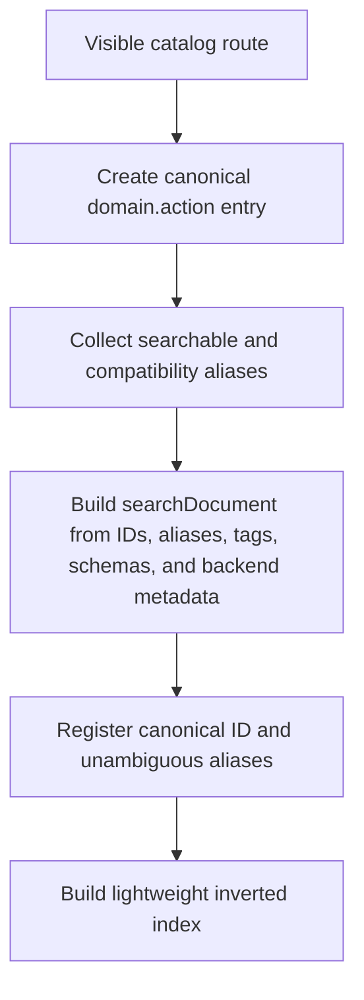
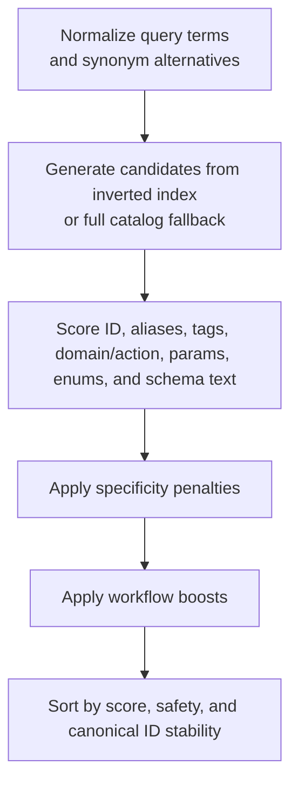
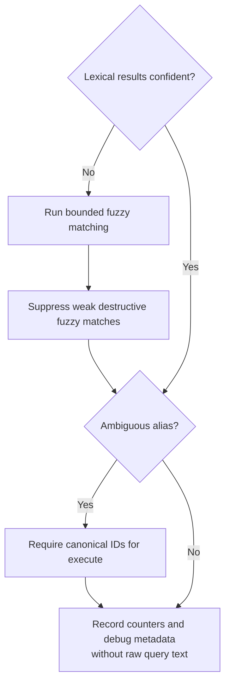

# Dynamic Search Ranker

This document describes the current dynamic action search ranker.

## Current Behavior

Dynamic mode builds the executable action registry eagerly when an MCP server instance is created. In stdio mode this happens during server startup. In HTTP mode this happens per token and GitLab URL server-pool entry, after enterprise detection, token-scope filtering, read-only mode, safe mode, and excluded-tool filtering have been applied.

The current registry stores each visible action as an `actionEntry` with:

- Canonical `domain.action` ID.
- Backing meta-tool name.
- Domain and action names.
- Compatibility aliases.
- Curated and schema-derived tags.
- Required and optional params.
- Field-aware `searchDocument` metadata built from ID words, tool name, domain, action, aliases, tags, required params, optional params, schema property names, schema enum values, and compact schema description terms.
- Flat lower-case `SearchText` kept as a compatibility fallback during the ranker migration.
- Tokenized `SearchTokens` for fuzzy fallback.

Search first uses a lightweight inverted index to gather candidates from aliases, domains, actions, and indexed metadata tokens. If no bucket matches, it deliberately falls back to the full visible catalog so ranking remains deterministic instead of returning an accidental empty set. It then scores each normalized query term against typed action metadata, falling back to flat text for compatibility. Exact canonical IDs score highest, followed by aliases, tags, exact domain or action names, partial ID matches, partial domain or action matches, typed field matches, and broader flat text matches. Synonyms and verb alternatives are expanded before scoring.

Callers may pass `explain:true` to `gitlab_find_action` to include deterministic scoring explanations. The default remains compact and omits explanations. Explanation mode reuses the same scoring path as non-explanation mode, so enabling explanations does not change ranking.

Search and describe results also include curated `related_actions` for workflows where ordering matters, such as comparing refs before generating release notes or checking tag/release state before deletion. These relationships are intentionally sparse and live with the action UX metadata next to usage hints.

No-match searches return a small `suggestions` list built from nearby indexed tokens plus common domains. This gives recovery guidance without exposing or dumping the full catalog.

Fuzzy matching is conservative. It runs when lexical search returns no matches or only low-confidence matches, ignores query tokens shorter than three characters, and uses bounded Levenshtein distance with a maximum of two edits. Fuzzy recovery is filtered so weak typo matches do not elevate destructive actions.

Long prompts are searched twice: once as the whole normalized query, and again through overlapping three- to six-term windows when the query is long enough. Segmented search runs for queries longer than six meaningful terms, or for five- and six-term queries when the requested result limit is 10 or lower. Each segment match receives a large window-size boost so multi-intent prompts can surface each relevant action without forcing the model to split the prompt perfectly.

`describe` and `execute` accept canonical action IDs and unambiguous aliases. Ambiguous aliases are rejected with repair guidance listing the valid canonical action IDs. Dynamic `execute` normalizes schema-safe parameter aliases before dispatch, logs name-only normalization metadata at debug level, and reports unknown or missing parameters with valid schema fields before calling the route handler. It does not silently drop unsupported security-sensitive fields such as `masked` or `protected`; callers receive validation feedback and must retry with fields accepted by the selected action schema. Destructive actions still require explicit `confirm:true` before execution.

## Ranking Weights

| Signal                                      | Weight |
| ------------------------------------------- | -----: |
| Exact canonical action ID                   |    120 |
| Exact alias                                 |    100 |
| Exact tag                                   |     90 |
| Exact domain or action                      |     80 |
| Split domain or action word                 |     65 |
| Partial canonical ID                        |     55 |
| Partial domain or action                    |     45 |
| Required param match                        |     35 |
| Schema enum match                           |     28 |
| Typed field or raw flat-text match          |     25 |
| Optional param match                        |     22 |
| Synonym or verb alternative flat-text match |     18 |
| Schema description match                    |     12 |

The base score is scaled by the matched-term ratio. One- or two-term queries must match all meaningful terms; longer queries may miss one term so incidental words do not suppress a good action. The top result is marked `low_confidence` if its score is below 80 or its margin over the second result is below 15.

Additional scoring adjustments:

| Adjustment                                         | Value |
| -------------------------------------------------- | ----: |
| Verb-intent boost for matching read/write/workflow |    16 |
| Verb-intent penalty for mismatched intent          |   -24 |
| Destructive verb boost for delete/remove/revoke    |    48 |
| Required parameter signal boost                    |    10 |
| Optional parameter signal boost                    |     5 |
| Compound tag match boost                           |    50 |
| Unmatched action-specific word penalty, per word   |   -60 |
| Segmented-search boost, per matched window term    |    90 |

## Operational Limits

These constants are intentionally internal tuning values, not user-facing configuration knobs. They are documented here so maintainers can explain observed ranking behavior and update tests deliberately when changing them.

| Area                       | Current value                                                                                                            |
| -------------------------- | ------------------------------------------------------------------------------------------------------------------------ |
| `gitlab_find_action.limit` | Defaults to 20 results and is capped at 50                                                                               |
| Meaningful terms           | Query text is lower-cased, split on spaces, dots, underscores, and hyphens, then filtered through stopwords              |
| Stopwords                  | `a`, `an`, `and`, `as`, `at`, `by`, `for`, `from`, `in`, `of`, `on`, `or`, `please`, `the`, `to`, `using`, `via`, `with` |
| Required matched terms     | All terms for one- or two-term queries; all but one term for longer queries                                              |
| Fuzzy edit distance        | Maximum two Levenshtein edits                                                                                            |
| Fuzzy token length         | Query parts shorter than three characters are not fuzzy-matched                                                          |
| Fuzzy distance scores      | Distance 0 = 40, distance 1 = 34, distance 2 = 28, plus 2 when first letters match                                       |
| Fuzzy destructive safety   | Destructive fuzzy results require an exact destructive verb plus a resource/action/tag signal                            |
| Segmented search windows   | Three to six meaningful terms                                                                                            |
| No-match suggestions       | Up to six nearby indexed tokens, then common fallback domains                                                            |
| Unknown action suggestions | Up to five nearby canonical action IDs                                                                                   |
| Unknown param suggestions  | Levenshtein recovery against valid params with maximum distance three                                                    |
| Markdown param guidance    | At most two parameter-guidance snippets in compact `gitlab_find_action` Markdown                                         |

## Alias Metadata

Dynamic aliases have explicit source metadata:

| Source              | Meaning                                                       |
| ------------------- | ------------------------------------------------------------- |
| `catalog`           | Native alias supplied by the canonical action catalog.        |
| `compatibility`     | Backward-compatible alias maintained by the dynamic registry. |
| `provider_observed` | Alias observed in model output and kept for repair tolerance. |
| `standalone`        | Alias associated with standalone dynamic-only actions.        |
| `deprecated`        | Alias retained only for temporary migration compatibility.    |

Aliases also carry a `Searchable` flag. Searchable aliases influence ranking and appear in the field-aware search document. Non-searchable aliases still canonicalize in `describe` and `execute`, but they do not influence search ranking. This is useful for compatibility aliases such as `repository_tree` that are safe to accept as input but too broad for discovery ranking.

Run the alias audit with:

```bash
go run ./cmd/audit_dynamic_aliases/
```

## Schema Signals And Param Repair

The dynamic search document keeps compact schema-derived terms for discovery:

- Required params score above optional params.
- Enum values can help queries that mention concrete states such as `opened` or `closed`.
- Property descriptions contribute low-weight terms so useful wording can help discovery without overpowering canonical action metadata.

Dynamic execution performs two param-normalization passes before dispatch:

- Common schema-safe aliases from `toolutil.NormalizeParamAliasesForSchemaWithExplanation`, such as `search` to `query` or `mr_iid` to `merge_request_iid`.
- Action-scoped aliases from `NormalizeActionScopedParamsWithExplanation`, such as `branch` to `ref` for `repository.file_get`, `status` to `scope` for `job.list`, and role-name conversion for access-level fields.

The explanation data records parameter names, source, and notes only. It never records parameter values. Normal dynamic output does not include this metadata; it is used for debug logging and tests.

## Search Flow Pseudocode

Registry build:



Candidate generation and scoring:



Fuzzy, ambiguity, and metrics:



## Observability

Dynamic search emits a structured debug log for each search with query length, result count, whether fuzzy recovery contributed results, whether the top result is low confidence, whether the query matched an ambiguous alias, the number of destructive fuzzy matches suppressed, and the top action ID. The raw query text is not logged.

Process-local runtime counters are available through `SearchRuntimeMetricsSnapshot()` for tests and future diagnostics. They count total searches, zero-result searches, fuzzy fallback searches, ambiguous alias queries, low-confidence searches, and destructive fuzzy suppressions.

Static registry metrics are available through `Registry.Metrics()` and are reported by:

```bash
go run ./cmd/audit_metrics/
```

The metrics include dynamic action count, search index token/posting counts, total aliases, searchable aliases, unsearchable aliases, and ambiguous aliases. The visible dynamic MCP tool count remains unchanged at two public tools: `gitlab_find_action` and `gitlab_execute_action`.

## Regression Corpus

The deterministic search corpus lives in `internal/tools/dynamic/testdata/dynamic_search_queries.json`. It covers exact canonical IDs, aliases, provider-invented aliases, natural language, typo recovery, ambiguous aliases, long multi-intent prompts, destructive prompts, schema-param prompts, and no-match prompts.

Run it after ranker changes with:

```bash
go test ./internal/tools/dynamic/ -run TestDynamicSearchCorpus -count=1
```

## Backend Metadata

The internal search document includes backend-oriented fields: `Backend`, `Capability`, `Resource`, `Operation`, and `Scope`. Current GitLab entries default `Backend` to `gitlab`, infer a coarse capability from the domain, and derive scope from schema fields such as `project_id` or `group_id`.

This does not expose non-GitLab actions. It prepares the ranker for future DADL-like or cross-backend catalogs by giving each action a stable place for provider, resource, operation, and scope metadata. Backend terms such as `github`, `jira`, `pull request`, `merge request`, `pr`, `mr`, `issue`, and `ticket` normalize to the current GitLab catalog vocabulary so searches remain useful while action IDs stay GitLab-only.

## Regression Checks

The following checks passed before ranker refactoring began:

```bash
go test ./internal/tools/dynamic/ -run 'Test.*Search|Test.*Describe|Test.*Execute|Test.*Fuzzy' -count=1
```

## Benchmark Command

The current benchmark command is:

```bash
go test ./internal/tools/dynamic/ -bench BenchmarkSearch_BaselineMetaCatalog -benchmem -run '^$'
```

Keep benchmark snapshots in ignored local reports or implementation plans when they are needed for a specific optimization decision. This reference document keeps the reproducible command and architecture, not run-specific timing data.

## Known Limitations

- Search explanations are opt-in and intentionally compact; they explain the strongest deterministic matches rather than every internal scoring adjustment.
- Candidate generation uses a lightweight in-memory index with full-scan fallback; it is not persisted and is rebuilt per dynamic registry.
- Param normalization explanations are debug-oriented and are not returned in normal `gitlab_execute_action` responses.
