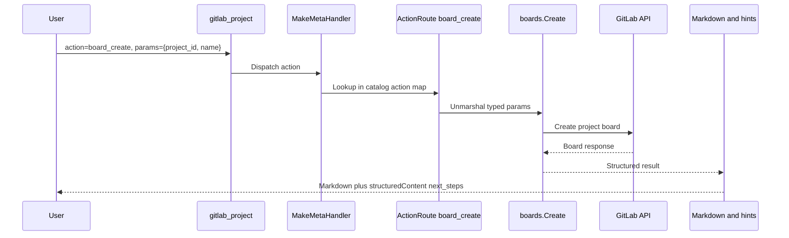

# Meta-Tools Reference

Meta-tools group related GitLab operations under a single MCP tool with an `action` parameter. Instead of 1027 self-managed Enterprise/Premium individual tools or 1033 GitLab.com Enterprise/Premium tools, **33 base meta-tools** (49 self-managed Enterprise/Premium, 50 on GitLab.com Enterprise/Premium) provide the same functionality while reducing token overhead for LLMs.

> **Diátaxis type**: Reference
> **Audience**: 👤🔧 All users
> **Prerequisites**: Understanding of MCP protocol and tool concepts

In meta-tool mode (`TOOL_SURFACE=meta`), the server registers **33 base GitLab/interactive tools**: 29 catalog-backed meta-tools plus 4 interactive elicitation tools. The Enterprise/Premium catalog registers 16 additional enterprise inline meta-tools for **49 tools** on self-managed GitLab, and GitLab.com Enterprise/Premium adds the experimental `gitlab_orbit` meta-tool for **50 tools**. The default tool surface is now dynamic find/execute; set `TOOL_SURFACE=meta` when you want this consolidated domain dispatcher catalog.

The `gitlab_server` update helper is registered separately for server maintenance actions and is not included in the 33/49/50 GitLab action catalog counts.

Stdio mode enables the Enterprise/Premium catalog with `GITLAB_ENTERPRISE=true`. HTTP mode can force it with `--enterprise`, and otherwise auto-detects CE/EE per token+URL pool entry when GitLab reports edition.

`gitlab_orbit` is additionally gated to `https://gitlab.com`.

> **See also**: [Tools Reference](tools/README.md) | [Configuration](configuration.md) | [ADR-0005](adr/adr-0005-meta-tool-consolidation.md)
> 📖 **User documentation**: See the [Meta-tools](https://jmrplens.github.io/gitlab-mcp-server/tools/meta-tools/) on the documentation site for a user-friendly version.

## How Meta-Tools Work

Each meta-tool accepts a common input format:

```json
{
  "action": "list",
  "params": {
    "project_id": "42",
    "owned": true
  }
}
```

The dispatcher routes the request to the underlying handler based on the `action` value. The `params` object contains the same parameters as the equivalent individual tool.

## Configuration

Meta-tools are available as an explicit tool surface. New configurations should use the canonical selector:

```env
TOOL_SURFACE=meta
```

The legacy boolean selector remains supported for one compatibility window, but new configuration should not use it:

```env
META_TOOLS=true
```

To switch from meta-tools to individual tools, use the explicit selector:

```env
TOOL_SURFACE=individual
```

The old `META_TOOLS=false` spelling still maps to `TOOL_SURFACE=individual` when `TOOL_SURFACE` is absent.

```env
META_TOOLS=false
```

Meta-tools remain available because they are the most broadly compatible consolidated surface.

| Mode             |                                                                         Tool Count | Best For                                                                   |
| ---------------- | ---------------------------------------------------------------------------------: | -------------------------------------------------------------------------- |
| Meta-tools       |    33 base / 49 self-managed Enterprise/Premium / 50 GitLab.com Enterprise/Premium | LLM clients that need the complete GitLab surface with a compact tool list |
| Individual tools | 867 CE / 1027 self-managed Enterprise/Premium / 1033 GitLab.com Enterprise/Premium | Clients that benefit from one MCP tool per GitLab operation                |

---

## Meta-Tool Inventory

### Core Inline Meta-Tools (17)

| #   | Tool Name              | Actions | Domain                                                                                                                                                                                   |
| --- | ---------------------- | ------- | ---------------------------------------------------------------------------------------------------------------------------------------------------------------------------------------- |
| 1   | `gitlab_project`       | ~92     | Projects, uploads, hooks, badges, boards, import/export, statistics, pages                                                                                                               |
| 2   | `gitlab_branch`        | 11      | Branches, protected branches, branch rules                                                                                                                                               |
| 3   | `gitlab_tag`           | 9       | Tags, protected tags                                                                                                                                                                     |
| 4   | `gitlab_release`       | 11      | Releases, release links                                                                                                                                                                  |
| 5   | `gitlab_merge_request` | ~46     | MR CRUD, approvals, context-commits, MR emoji, MR resource events                                                                                                                        |
| 6   | `gitlab_mr_review`     | ~22     | MR notes, discussions, drafts, changes                                                                                                                                                   |
| 7   | `gitlab_repository`    | ~40     | Repository tree/compare, commit discussions, files, submodules, markdown                                                                                                                 |
| 8   | `gitlab_group`         | ~64     | Groups, members, labels, milestones, boards, uploads, import/export, epic discussions                                                                                                    |
| 9   | `gitlab_issue`         | ~55     | Issues, notes, discussions, links, statistics, issue emoji, issue resource events                                                                                                        |
| 10  | `gitlab_pipeline`      | ~34     | Pipelines, pipeline triggers, pipeline schedules, wait                                                                                                                                   |
| 11  | `gitlab_job`           | ~25     | Jobs, job token scope, wait                                                                                                                                                              |
| 12  | `gitlab_user`          | ~29     | Users, events, notifications, keys, namespaces, avatar                                                                                                                                   |
| 13  | `gitlab_wiki`          | 6       | Project/group wikis                                                                                                                                                                      |
| 14  | `gitlab_environment`   | ~23     | Environments, protected envs, freeze periods, deployments                                                                                                                                |
| 15  | `gitlab_ci_variable`   | ~15     | CI/CD variables (project, group, instance)                                                                                                                                               |
| 16  | `gitlab_template`      | 12      | CI/CD, Dockerfile, gitignore templates                                                                                                                                                   |
| 17  | `gitlab_admin`         | ~82     | Server settings, broadcast messages, features, license, system hooks, error tracking, alert management, secure files, terraform states, cluster agents, dependency proxy, import service |

### Consolidated Inline Meta-Tools (4)

| #   | Tool Name              | Actions | Sources                                                             |
| --- | ---------------------- | ------- | ------------------------------------------------------------------- |
| 18  | `gitlab_access`        | ~48     | Access tokens, deploy tokens, deploy keys, access requests, invites |
| 19  | `gitlab_package`       | ~20     | Packages, container registry                                        |
| 20  | `gitlab_snippet`       | ~30     | Snippets, snippet discussions, snippet emoji                        |
| 21  | `gitlab_feature_flags` | ~10     | Feature flags, feature flag user lists                              |

### Always-Registered Meta-Tools (3)

| #   | Tool Name               | Actions | Source                                        |
| --- | ----------------------- | ------- | --------------------------------------------- |
| 22  | `gitlab_model_registry` | 1       | ML model registry package download            |
| 23  | `gitlab_ci_catalog`     | 2       | CI/CD Catalog resource discovery (GraphQL)    |
| 24  | `gitlab_custom_emoji`   | 3       | Group-level custom emoji management (GraphQL) |

### Delegated Meta-Tools (2)

| #   | Tool Name       | Actions | Source                                         |
| --- | --------------- | ------- | ---------------------------------------------- |
| 25  | `gitlab_search` | 10      | Global, project, group search                  |
| 26  | `gitlab_runner` | 34      | Runners, runner management, runner controllers |

### Sampling Tools (1)

| #   | Tool Name        | Actions | Source                                                                                                                                             |
| --- | ---------------- | ------- | -------------------------------------------------------------------------------------------------------------------------------------------------- |
| 27  | `gitlab_analyze` | 11      | LLM-powered analysis via MCP sampling (MR changes, issues, pipelines, security, deployments, CI config, milestones, release notes, technical debt) |

### Standalone Tools (1)

| #   | Tool Name                 | Actions | Source                                      |
| --- | ------------------------- | ------- | ------------------------------------------- |
| 28  | `gitlab_discover_project` | 1       | Git remote URL to GitLab project resolution |

### Interactive Elicitation Tools (4)

| #   | Tool Name                           | Actions                                                               | Domain/Source |
| --- | ----------------------------------- | --------------------------------------------------------------------- | ------------- |
| 29  | `gitlab_interactive_issue_create`   | Guided prompts for issue fields with final confirmation               | GitLab        |
| 30  | `gitlab_interactive_mr_create`      | Guided prompts for branch, title, metadata, and confirmation          | GitLab        |
| 31  | `gitlab_interactive_project_create` | Guided prompts for name, visibility, initialization, and confirmation | GitLab        |
| 32  | `gitlab_interactive_release_create` | Guided prompts for tag, name, notes, and confirmation                 | GitLab        |

### GitLab.com Enterprise/Premium Meta-Tools (1)

| #   | Tool Name      | Actions | Source                                                                                                          |
| --- | -------------- | ------- | --------------------------------------------------------------------------------------------------------------- |
| 33  | `gitlab_orbit` | 6       | Experimental GitLab.com Orbit Knowledge Graph API (`status`, `schema`, `tools`, `dsl`, `query`, `graph_status`) |

---

## Architecture

### Consolidation Decision

ADR-0005 records the historical consolidation from many standalone meta-tools to the current domain-oriented taxonomy. The stable architecture described here is the current contract: broad visible domain tools, Enterprise/Premium gating for premium groups, and GitLab.com-only gating for `gitlab_orbit`.

The consolidated surface reduces:

- Token usage in `tools/list` MCP responses
- LLM selection confusion when choosing among similar tools
- Client rendering overhead for tool palettes

### Implementation Pattern

Meta-tools are registered from the canonical action catalog built by `internal/tools.BuildActionCatalog()`.
`RegisterAllMeta()` registers visible domain dispatchers from that catalog.
Developers define action metadata through `ActionSpec` and `CatalogGroupSpec`; meta-tools use that metadata for parameter schemas, output schemas, destructive flags, aliases, usage hints, individual projection policy, and result formatting.

All meta-tools use the shared infrastructure in `internal/toolutil/metatool.go`:

- `ActionSpec` — canonical action metadata, including the typed route, ownership, aliases, tags, usage hints, projection policy, result policies, and compatibility policy
- `CatalogGroupSpec` — visible meta-tool group metadata and the ordered action set used to build the catalog
- `ActionRoute` — pairs a handler with metadata-driven classification. Typed routes carry both `InputSchema` and `OutputSchema` so each action can expose exact params and result contracts
- `Route(fn)` / `DestructiveRoute(fn)` — legacy constructors for already-adapted handlers
- `DeriveAnnotations(routes)` — auto-derives tool-level annotations from route metadata: if any route is destructive → `MetaAnnotations`, otherwise → `NonDestructiveMetaAnnotations`
- `MakeMetaHandler()` — creates action-dispatch handlers from route maps; successful results automatically enrich `structuredContent` with `next_steps` hints extracted from Markdown, while `isError` results omit structured content
- `MetaToolInput` — common input struct with `action` and `params` fields
- `MetaAnnotations` — shared annotations (destructiveHint: true) for meta-tools with destructive actions
- `ReadOnlyMetaAnnotations` — for meta-tools with only read operations (e.g., `gitlab_template`, `gitlab_search`)
- `NonDestructiveMetaAnnotations` — for meta-tools without destructive actions (e.g., `gitlab_user`)
- `RouteAction()` / `RouteVoidAction()` / `DestructiveAction()` / `DestructiveVoidAction()` — composite wrappers that combine handler adaptation, route classification, and input/output schema capture
- `RouteActionWithRequest()` / `DestructiveActionWithRequest()` / `DestructiveVoidActionWithRequest()` — request-aware variants for handlers that need the incoming MCP request; they preserve the same input/output schema capture and route classification as their non-request counterparts

### How Actions Are Routed



### Response Enrichment

Successful meta-tool responses include a `next_steps` array in the JSON `structuredContent`. This is critical for IDEs like VS Code that only read JSON:

```json
{
  "branches": [...],
  "pagination": { "page": 1, "total_pages": 2, "has_more": true },
  "next_steps": [
    "When presenting these results, always include the clickable [text](url) links",
    "Get details of a specific branch",
    "Create a new branch from any ref"
  ]
}
```

The enrichment is automatic — `MakeMetaHandler` calls `enrichWithHints()` which parses the Markdown "💡 Next steps" section and merges the hints into the JSON output. If a route returns `isError: true`, `MakeMetaHandler` returns the actionable Markdown error without `structuredContent`, matching the MCP rule that successful structured results must conform to the declared `OutputSchema`.

See [Output Format](output-format.md) for the complete response format specification.

---

## Usage Examples

### List projects

```json
{
  "tool": "gitlab_project",
  "arguments": {
    "action": "list",
    "params": { "owned": true, "per_page": 10 }
  }
}
```

### Create an issue

```json
{
  "tool": "gitlab_issue",
  "arguments": {
    "action": "create",
    "params": {
      "project_id": "my-group/my-project",
      "title": "Fix login bug",
      "labels": "bug,critical"
    }
  }
}
```

### Search code

```json
{
  "tool": "gitlab_search",
  "arguments": {
    "action": "code",
    "params": {
      "query": "func RegisterTools"
    }
  }
}
```

### Delete a branch (with confirmation)

```json
{
  "tool": "gitlab_branch",
  "arguments": {
    "action": "delete",
    "params": {
      "project_id": "42",
      "branch_name": "feature/old-branch"
    }
  }
}
```

If the MCP client supports elicitation, the server will ask for user confirmation before executing destructive actions. Set `YOLO_MODE=true` or `AUTOPILOT=true` to skip confirmation.

---

## Discovering the params shape

Meta-tools advertise a deliberately compact input schema by default (`META_PARAM_SCHEMA=opaque`): the LLM sees the `action` enum and an opaque `params` object. To discover the exact `params` shape for a chosen action, two mechanisms are available:

1. **MCP Resource** (recommended with `CAPABILITY_SURFACE=full`) — read the per-action call shape and JSON Schema:

   ```text
   gitlab://tools/{tool}.{action}
   ```

   For example, `gitlab://tools/gitlab_merge_request.create` returns the call shape and JSON Schema for the `create` action's `params`. The `gitlab://tools` manifest enumerates every visible meta-tool action in the active server configuration.

   The manifest resource returns a JSON object with the URI template, visible tools, and action entries for the current server configuration:

   ```json
   {
     "surface": "meta",
     "uri_template": "gitlab://tools/{id}",
     "entries": [
       {
         "tool": "gitlab_merge_request",
         "id": "gitlab_merge_request.create",
         "action": "create"
       }
     ]
   }
   ```

   After choosing a tool/action pair, read the concrete detail resource for that action. For example:

   ```json
   {
     "method": "resources/read",
     "params": {
       "uri": "gitlab://tools/gitlab_merge_request.create"
     }
   }
   ```

   The response content includes the JSON Schema for the `params` object and the common meta-tool envelope expected for the final tool call:

   ```json
   {
     "action": "create",
     "params": {
       "project_id": "42",
       "source_branch": "feature/docs",
       "target_branch": "main",
       "title": "Update documentation"
     }
   }
   ```

  These resources remain available for meta-tools when `CAPABILITY_SURFACE=minimal` is enabled, while optional GitLab data resources, prompts, and workflow guides are omitted. Dynamic surfaces can use `gitlab_find_action` for inline schemas in minimal mode; meta-tool callers can keep `META_PARAM_SCHEMA=opaque` and read `gitlab://tools/{id}` for exact params.

1. **Embed schemas in the tool description** — set `META_PARAM_SCHEMA=full` (or the lighter `compact` mode) at startup. The meta-tool's `inputSchema` then exposes a `oneOf` discriminating on `action`, with the per-action params shape inlined. Current audit metrics show `full` is 11.9x larger than `opaque`, and `compact` is 6.5x larger, so keep `opaque` unless your MCP client cannot read resources. See [env-reference.md](env-reference.md) for size/cost trade-offs.

The dispatch behaviour is identical across modes — only the schema sent to the LLM changes.
