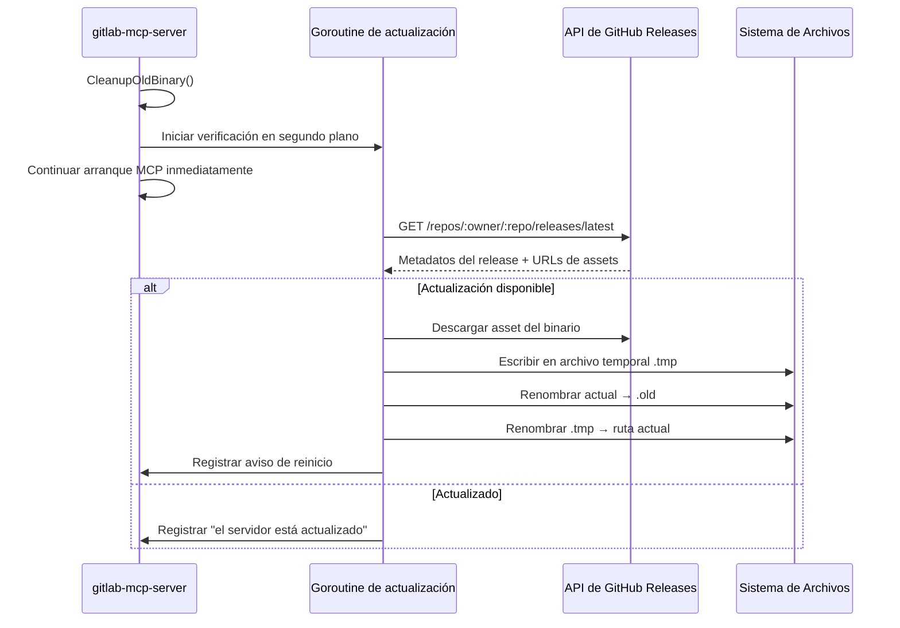

:::note[Documentación para desarrolladores]
Para la referencia técnica completa, consulta [`docs/auto-update.md`](https://github.com/jmrplens/gitlab-mcp-server/blob/main/docs/auto-update.md) en el repositorio.
:::

GitLab MCP Server puede detectar, descargar y aplicar automáticamente nuevas versiones desde GitHub. Las actualizaciones usan un **truco de renombrado** — el binario en ejecución se renombra a `.old` y el nuevo binario se coloca en la ruta original. El proceso MCP actual sigue sirviendo; reinícialo para usar el nuevo binario.

## Modos de actualización

La variable `AUTO_UPDATE` controla cómo se manejan las actualizaciones:

| Valor                | Modo                    | Comportamiento                                                       |
| -------------------- | ----------------------- | -------------------------------------------------------------------- |
| `true` (por defecto) | Aplicar automáticamente | Detectar y aplicar actualizaciones automáticamente                   |
| `check`              | Solo notificar          | Detectar actualizaciones y registrar disponibilidad, pero no aplicar |
| `false`              | Deshabilitado           | Omitir todas las verificaciones de actualización                     |

Alias aceptados: `1`/`yes` para true, `0`/`no` para false. El valor no distingue mayúsculas de minúsculas.

## Cómo funciona



### Verificación al inicio (modo stdio)

En modo stdio (el predeterminado), la actualización automática se ejecuta como una **verificación de arranque en segundo plano** con un timeout configurable (por defecto: 60 segundos). El arranque MCP continúa inmediatamente mientras la detección de releases y las descargas se ejecutan en segundo plano:

1. `CleanupOldBinary()` elimina cualquier archivo `.old` sobrante de una actualización anterior
2. El servidor programa la verificación en una goroutine en segundo plano
3. Verifica si hay una versión más nueva en GitHub sin bloquear la negociación de herramientas MCP
4. Si el modo es `true` y existe una versión más nueva, descarga y reemplaza el binario
5. Registra un aviso de reinicio para que el siguiente proceso del servidor use la nueva versión

La verificación al inicio es **no bloqueante y no fatal** — cualquier error (timeout de red, releases no encontrados) se registra como advertencia y no impide que el servidor arranque ni acepte peticiones MCP.

### Verificación periódica (modo http)

En modo HTTP, la actualización automática se ejecuta como una **verificación periódica en segundo plano**:

1. Una goroutine verifica actualizaciones cada `AUTO_UPDATE_INTERVAL` (por defecto: 1 hora)
2. En cada ciclo, verifica GitHub para un release más nuevo con un timeout de 30 segundos
3. Si el modo es `true`, aplica la actualización y registra un aviso de reinicio
4. La goroutine se detiene cuando el servidor se apaga

## Configuración

### Variables de entorno (modo stdio)

| Variable               | Por Defecto                  | Descripción                                                                       |
| ---------------------- | ---------------------------- | --------------------------------------------------------------------------------- |
| `AUTO_UPDATE`          | `true`                       | Modo de actualización: `true`, `check` o `false`                                  |
| `AUTO_UPDATE_REPO`     | `jmrplens/gitlab-mcp-server` | Slug del repositorio de GitHub (`propietario/repo`) para assets del release       |
| `AUTO_UPDATE_INTERVAL` | `1h`                         | Intervalo de verificación (usado por las verificaciones periódicas del modo HTTP) |
| `AUTO_UPDATE_TIMEOUT`  | `60s`                        | Timeout de actualización de arranque/en segundo plano (rango: 5s–10m)             |

### Flags de CLI (modo http)

| Flag                     | Por Defecto                  | Descripción                                                                 |
| ------------------------ | ---------------------------- | --------------------------------------------------------------------------- |
| `--auto-update`          | `true`                       | Modo de actualización: `true`, `check` o `false`                            |
| `--auto-update-repo`     | `jmrplens/gitlab-mcp-server` | Slug del repositorio de GitHub (`propietario/repo`) para assets del release |
| `--auto-update-interval` | `1h`                         | Intervalo entre verificaciones periódicas de actualización                  |
| `--auto-update-timeout`  | `60s`                        | Timeout de actualización de arranque/en segundo plano (rango: 5s–10m)       |

:::note
La actualización automática usa la **API de GitHub Releases** — es completamente independiente de tu configuración de GitLab. Tus ajustes de `GITLAB_URL`, `GITLAB_TOKEN` y `GITLAB_SKIP_TLS_VERIFY` no afectan a la actualización automática.
:::

### Ejemplos de configuración

Desactivar la actualización automática completamente:

```ini
AUTO_UPDATE=false
```

Modo de solo verificación (registrar disponibilidad pero no aplicar):

```ini
AUTO_UPDATE=check
```

Usar un repositorio fork personalizado:

```ini
AUTO_UPDATE_REPO=mi-org/mi-fork-gitlab-mcp
```

## Flag de apagado para actualizadores externos

Herramientas externas (como pe-agnostic-store) pueden terminar todas las instancias en ejecución antes de reemplazar el binario en disco:

```bash
gitlab-mcp-server --shutdown
```

Este flag:

1. Encuentra todos los procesos `gitlab-mcp-server` en ejecución por nombre
2. Envía una señal de terminación graceful
3. Espera hasta 5 segundos a que los procesos terminen
4. Fuerza la terminación de cualquier proceso restante
5. Finaliza — no se inicia ningún servidor MCP

No se requieren permisos de administrador o root. Esto funciona en Linux, macOS y Windows.

## Reversión

Si una actualización causa problemas:

1. El binario anterior se conserva como `gitlab-mcp-server.old` (o `.exe.old` en Windows) junto al binario actual
2. Para revertir, detén el servidor y renombra el archivo `.old` de vuelta al nombre original
3. El archivo `.old` se limpia automáticamente en el próximo inicio exitoso

## Soporte de repositorio personalizado

Puedes apuntar la actualización automática a cualquier repositorio de GitHub que siga el formato de release esperado:

1. Establece `AUTO_UPDATE_REPO=propietario/repo` a tu repositorio
2. Crea releases en GitHub con binarios de plataforma nombrados `gitlab-mcp-server-{os}-{arch}`
3. Incluye un asset `checksums.txt` con hashes SHA-256 (formato goreleaser)

:::caution
Los nombres de los assets del release **deben ser nombres de archivo exactos** (ej., `gitlab-mcp-server-linux-amd64`). Nunca añadas sufijos descriptivos como `(Linux AMD64)` — la librería de actualización busca por nombre exacto y fallará con nombres decorados.
:::
