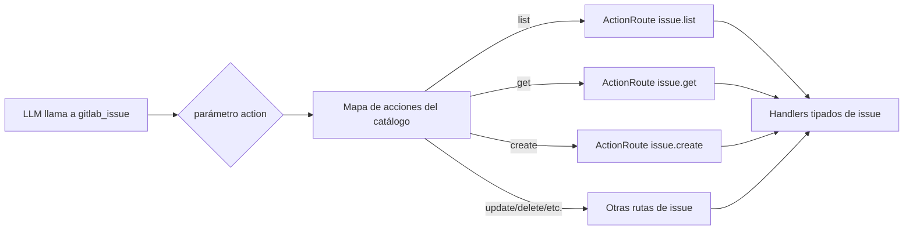

:::note[Documentación para desarrolladores]
Para la referencia técnica completa, consulta [`docs/meta-tools.md`](https://github.com/jmrplens/gitlab-mcp-server/blob/main/docs/meta-tools.md) en el repositorio.
:::

Las meta-herramientas son un modo de operación explícito de GitLab MCP Server, habilitado con `TOOL_SURFACE=meta`. En lugar de exponer cada operación de la API de GitLab como una herramienta MCP separada, las meta-herramientas **agrupan operaciones relacionadas bajo una única herramienta** con un parámetro `action` que despacha al handler correcto.

## ¿Por qué meta-herramientas?

Los LLMs tienen ventanas de contexto limitadas. Cuando un servidor MCP registra cientos de herramientas individuales (hasta 1033 en GitLab.com Enterprise/Premium), solo las descripciones de las herramientas consumen una gran porción de los tokens disponibles, dejando menos espacio para la conversación real.

| Modo              | Nº de herramientas | Overhead de tokens | Funcionalidad               |
| ----------------- | ------------------ | ------------------ | --------------------------- |
| Individual        | 867 / 1027 / 1033  | Muy alto           | Completa                    |
| Meta (base)       | 33                 | Bajo               | Completa                    |
| Meta (enterprise) | 49 / 50            | Bajo               | Completa + Premium/Ultimate |

Las meta-herramientas reducen el recuento de herramientas en **más del 95%** mientras preservan el 100% de la funcionalidad. Cada operación de herramienta individual está disponible como una acción dentro de una de las meta-herramientas de dominio.

El helper de actualización `gitlab_server` puede aparecer por separado para acciones de mantenimiento del servidor y no está incluido en los conteos 33/49/50 del catálogo de acciones GitLab.

:::note[Compatibilidad con clientes]
Algunos clientes de IA imponen límites en el número de herramientas (por ejemplo, JetBrains AI Assistant limita los servidores MCP a 100 herramientas). El modo meta-herramientas (33 herramientas base, 49 herramientas enterprise autoalojadas o 50 herramientas GitLab.com Enterprise con Orbit) funciona dentro de estas restricciones. Si seleccionas herramientas individuales con `TOOL_SURFACE=individual`, los clientes con dichos límites solo verán un subconjunto del conjunto completo de herramientas individuales.
:::

## Cómo funcionan las meta-herramientas

Cada meta-herramienta define un enum `action` que lista todas las operaciones disponibles. El servidor valida la acción y la despacha a la función handler correspondiente internamente.



El parámetro action siempre es requerido y debe ser uno de los valores enumerados. Los parámetros adicionales dependen de la acción elegida.

## Descubrir parámetros por acción

Las meta-herramientas usan un sobre común:

```json
{
	"action": "create",
	"params": {
		"project_id": "42"
	}
}
```

Por defecto, `META_PARAM_SCHEMA=opaque` mantiene pequeño el schema de la herramienta: los clientes ven el enum válido de `action`, mientras `params` queda como un objeto específico de la acción. Para descubrir la forma exacta de una acción concreta, lee el manifiesto de herramientas:

| Recurso               | Uso                                                                                             |
| --------------------- | ----------------------------------------------------------------------------------------------- |
| `gitlab://tools`      | Lista herramientas visibles y entradas ejecutables para la superficie activa                    |
| `gitlab://tools/{id}` | Devuelve la forma de llamada aceptada y el JSON Schema de una acción, como `gitlab_project.get` |

Ejemplos de lectura de recursos:

```json
{
	"method": "resources/read",
	"params": {
		"uri": "gitlab://tools"
	}
}
```

```json
{
	"method": "resources/read",
	"params": {
		"uri": "gitlab://tools/gitlab_merge_request.create"
	}
}
```

La respuesta del detalle por acción incluye el schema de `params` y la forma de llamada final. Estos recursos siguen disponibles para meta-herramientas cuando `CAPABILITY_SURFACE=minimal` está habilitado, mientras se omiten recursos opcionales de GitLab, prompts y guías de flujo. Los despliegues dinámicos pueden seguir usando `gitlab_find_action` para schemas inline; los despliegues de meta-herramientas pueden mantener `META_PARAM_SCHEMA=opaque` y leer `gitlab://tools/{id}` en vez de incluir schemas en `tools/list`. Las métricas actuales muestran que `compact` es 6.5x más grande que `opaque`, y `full` es 11.9x más grande.

## Ejemplos de uso

### Crear un issue

```json
{
	"tool": "gitlab_issue",
	"arguments": {
		"action": "create",
		"params": {
			"project_id": "my-group/my-project",
			"title": "Update API documentation",
			"description": "The REST API docs are missing the new v2 endpoints",
			"labels": "documentation,api",
			"assignee_ids": "42",
			"milestone_id": 7
		}
	}
}
```

### Listar merge requests

```json
{
	"tool": "gitlab_merge_request",
	"arguments": {
		"action": "list",
		"params": {
			"project_id": "my-group/my-project",
			"state": "opened",
			"order_by": "updated_at",
			"per_page": 20
		}
	}
}
```

### Buscar código

```json
{
	"tool": "gitlab_search",
	"arguments": {
		"action": "code",
		"params": {
			"search": "func handleWebhook",
			"project_id": "my-group/my-project"
		}
	}
}
```

### Comprobar disponibilidad de Orbit

```json
{
	"tool": "gitlab_orbit",
	"arguments": {
		"action": "status",
		"params": {
			"response_format": "llm"
		}
	}
}
```

`gitlab_orbit` solo se registra para conexiones GitLab.com Enterprise/Premium y expone cinco acciones de solo lectura del Knowledge Graph: `status`, `schema`, `tools`, `query` y `graph_status`.

## Referencia de meta-herramientas clave

### `gitlab_project`

Gestiona el ciclo de vida y la configuración de proyectos.

**Acciones**: `list`, `get`, `create`, `update`, `delete`, `archive`, `unarchive`, `fork`, `star`, `unstar`, `transfer`, `languages`, `users`, `forks`, `starrers`, `hooks`, `create_hook`, `update_hook`, `delete_hook`

### `gitlab_issue`

Gestión completa del ciclo de vida de issues incluyendo etiquetas, asignados y transiciones de estado.

**Acciones**: `list`, `get`, `create`, `update`, `delete`, `close`, `reopen`, `subscribe`, `unsubscribe`, `move`, `clone`, `add_label`, `remove_label`, `set_assignees`, `add_time_spent`, `reset_time_spent`, `set_time_estimate`, `reset_time_estimate`

### `gitlab_merge_request`

Flujo de trabajo completo de merge requests desde la creación hasta el merge.

**Acciones**: `list`, `get`, `create`, `update`, `merge`, `close`, `reopen`, `rebase`, `approve`, `unapprove`, `subscribe`, `unsubscribe`, `add_label`, `remove_label`, `set_assignees`, `set_reviewers`, `add_time_spent`, `reset_time_spent`

### `gitlab_pipeline`

Gestión y monitorización de pipelines.

**Acciones**: `list`, `get`, `create`, `cancel`, `retry`, `delete`, `variables`, `test_report`, `bridges`, `wait`

### `gitlab_job`

Gestión de jobs de CI/CD.

**Acciones**: `list`, `get`, `play`, `cancel`, `retry`, `erase`, `trace`, `artifacts`, `download_artifact`, `delete_artifacts`, `delete_project_artifacts`, `wait`

### `gitlab_branch`

Operaciones con ramas.

**Acciones**: `list`, `get`, `create`, `delete`, `merged`

### `gitlab_commit`

Operaciones con commits e historial.

**Acciones**: `list`, `get`, `diff`, `refs`, `cherry_pick`, `revert`, `comments`, `create_comment`, `statuses`, `merge_requests`

### `gitlab_tag`

Gestión de tags.

**Acciones**: `list`, `get`, `create`, `delete`

### `gitlab_release`

Gestión del ciclo de vida de releases.

**Acciones**: `list`, `get`, `create`, `update`, `delete`, `evidences`

### `gitlab_label`

Gestión de etiquetas para proyectos y grupos.

**Acciones**: `list`, `get`, `create`, `update`, `delete`, `subscribe`, `unsubscribe`

### `gitlab_milestone`

Seguimiento de milestones.

**Acciones**: `list`, `get`, `create`, `update`, `delete`, `issues`, `merge_requests`

### `gitlab_member`

Membresía de proyectos y grupos.

**Acciones**: `list`, `get`, `add`, `update`, `remove`, `all`

### `gitlab_group`

Gestión de grupos y subgrupos.

**Acciones**: `list`, `get`, `create`, `update`, `delete`, `projects`, `subgroups`, `members`, `labels`, `milestones`, `hooks`

### `gitlab_search`

Búsqueda entre recursos en toda tu instancia de GitLab.

**Acciones**: `code`, `issues`, `merge_requests`, `commits`, `milestones`, `notes`, `projects`, `snippets`, `users`, `wiki`

### `gitlab_user`

Información y búsqueda de usuarios.

**Acciones**: `get`, `current`, `list`, `status`, `activities`

### `gitlab_wiki`

Gestión de páginas wiki.

**Acciones**: `list`, `get`, `create`, `update`, `delete`

### `gitlab_todo`

Lista personal de tareas pendientes.

**Acciones**: `list`, `mark_done`, `mark_all_done`

## Modo Enterprise

El catálogo Enterprise/Premium habilita 16 meta-herramientas adicionales que exponen funciones de GitLab Premium y Ultimate. En modo stdio, configura `GITLAB_ENTERPRISE=true`; en modo HTTP, usa `--enterprise` para forzar el catálogo u omítelo para permitir autodetección CE/EE por entrada token+URL. Además, se añaden rutas de acción solo enterprise a las meta-herramientas base existentes:

- **Iterations** → enrutadas a través de `gitlab_issue`
- **Project mirrors** → enrutadas a través de `gitlab_project`
- **SSH certificates** → enrutadas a través de `gitlab_group`
- **Security settings** → divididas entre `gitlab_project` y `gitlab_group`
- **Group credentials** → enrutadas a través de `gitlab_group`
- **Group analytics** → enrutadas a través de `gitlab_group`

:::tip
Puedes comprobar qué herramientas tiene registradas tu servidor mirando la salida del log de inicio o llamando al método MCP `tools/list`.
:::

## Configuración

| Variable             | Predeterminado | Descripción                                                                                                                                                                    |
| -------------------- | -------------- | ------------------------------------------------------------------------------------------------------------------------------------------------------------------------------ |
| `TOOL_SURFACE`       | `meta`         | Selector canónico para este modo: usa `meta` para meta-herramientas. Usa `individual` solo cuando quieras una herramienta MCP por operación de GitLab.                         |
| `META_TOOLS`         | heredado       | Selector de compatibilidad deprecado: `true` mapea a `meta`, y `false` mapea a `individual` cuando `TOOL_SURFACE` no está definido.                                            |
| `CAPABILITY_SURFACE` | `full`         | Selector del catálogo de recursos y prompts: `full` o `minimal`. Minimal mantiene `gitlab://workspace/roots` y `gitlab://tools`, y omite recursos opcionales, guías y prompts. |
| `META_PARAM_SCHEMA`  | `opaque`       | Controla cuánto schema de `params` por acción se incluye en `tools/list`: `opaque`, `compact` o `full`. Los schemas exactos están disponibles con `gitlab://tools/{id}`.       |
| `GITLAB_ENTERPRISE`  | `false`        | Habilitar meta-herramientas solo enterprise en modo stdio (requiere Premium/Ultimate).                                                                                         |
| `--enterprise`       | `false`        | En modo HTTP, forzar meta-herramientas enterprise; omítelo para autodetectar CE/EE por entrada token+URL.                                                                      |
