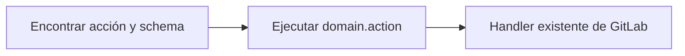

GitLab MCP Server expone las operaciones de GitLab como herramientas MCP que los asistentes de IA pueden invocar directamente. El servidor ofrece tres modos de operación para equilibrar capacidad con eficiencia de tokens.

Todos los modos cubren la misma superficie de API de GitLab. Cambia el empaquetado: el modo individual expone una herramienta MCP por operación, el modo meta-herramientas agrupa acciones por dominio, y el modo dinámico busca y ejecuta IDs canónicos `domain.action` desde el mismo catálogo de acciones.

## Modos de operación

### Modo individual

En modo individual, el servidor registra una herramienta por operación de GitLab: **867 herramientas** para CE, **1027 herramientas** para Enterprise/Premium autoalojado, o **1033 herramientas** en GitLab.com Enterprise/Premium cuando Orbit está disponible. Esto proporciona la máxima granularidad pero consume una cantidad significativa de tokens de contexto del LLM para el descubrimiento de herramientas.

### Modo meta-herramientas

En modo meta-herramientas (`TOOL_SURFACE=meta`), las operaciones relacionadas se consolidan en **meta-herramientas a nivel de dominio**. Cada meta-herramienta acepta un parámetro `action` que enruta al handler apropiado. Esto reduce el recuento de herramientas a **33 meta-herramientas base**, **49 en Enterprise/Premium autoalojado**, o **50 en GitLab.com Enterprise/Premium** cuando Orbit está disponible, mejorando drásticamente la eficiencia de tokens del LLM mientras se preserva toda la funcionalidad.

```json
{
	"tool": "gitlab_issue",
	"arguments": {
		"action": "create",
		"project": "my-group/my-project",
		"title": "Fix login redirect",
		"description": "Users are redirected to 404 after login",
		"labels": "bug,priority::high"
	}
}
```

### Conjunto de herramientas dinámico

El modo dinámico (`TOOL_SURFACE=dynamic`) es la alternativa de bajo consumo de tokens. Expone solo `gitlab_find_action` y `gitlab_execute_action`, mientras conserva las mismas acciones de GitLab detrás del catálogo canónico. El asistente encuentra una acción con su schema exacto y luego ejecuta el ID canónico `domain.action`.



Como las meta-herramientas y el modo dinámico comparten el catálogo de acciones canónico, el comportamiento de seguridad es consistente entre ambos modos: filtrado de solo lectura, previsualizaciones de safe mode, filtrado por scopes del token, confirmaciones destructivas, schemas y formato de resultados se definen una vez y se reutilizan.

## Convención de nombres de herramientas

Todas las herramientas siguen un patrón de nomenclatura consistente:

- **Herramientas individuales**: `gitlab_{action}_{resource}` (p. ej., `gitlab_create_issue`, `gitlab_list_projects`)
- **Meta-herramientas**: `gitlab_{domain}` (p. ej., `gitlab_issue`, `gitlab_project`)
- **Acciones dinámicas**: IDs canónicos `domain.action` ejecutados mediante `gitlab_execute_action` (p. ej., `issue.create`, `merge_request.list`)

## Meta-herramientas base (33)

### Gestión de proyectos

| Meta-herramienta | Descripción                                                                                                            | Acciones principales                                                                                         |
| ---------------- | ---------------------------------------------------------------------------------------------------------------------- | ------------------------------------------------------------------------------------------------------------ |
| `gitlab_project` | CRUD de proyectos, configuración, hooks, etiquetas, milestones, miembros, badges, tokens de acceso, todos, upload, etc | list, get, create, update, delete, fork, star, archive, label\_\*, milestone\_\*, members, badge\_\*, upload |
| `gitlab_issue`   | Ciclo de vida de issues, notas, discusiones, enlaces, work items (incluidos tipos de work item), seguimiento de tiempo, award emoji y eventos         | list, get, create, update, delete, note\_\*, link\_\*, discussion\_\*, work_item\_\*, time\_\*               |
| `gitlab_group`   | CRUD de grupos, subgrupos, miembros, badges, hooks, etiquetas, milestones, transferencia y proyectos descendientes     | list, get, create, update, delete, label\_\*, milestone\_\*, member\_\*, badge\_\*, hook\_\*                 |
| `gitlab_user`    | Información de usuarios, estado, claves SSH, claves GPG, emails, actividad, preferencias y cuentas de servicio de instancia (Enterprise)                              | get, current, list, ssh_key\_\*, gpg_key\_\*, email\_\*, status\_\*, service\_account\_\*                                          |
| `gitlab_wiki`    | Gestión de páginas wiki y adjuntos                                                                                     | list, get, create, update, delete, upload_attachment                                                         |

### Código y repositorio

| Meta-herramienta       | Descripción                                                                                                                  | Acciones principales                                                                          |
| ---------------------- | ---------------------------------------------------------------------------------------------------------------------------- | --------------------------------------------------------------------------------------------- |
| `gitlab_branch`        | Gestión de ramas y reglas de protección (incluyendo consultas de reglas de rama vía GraphQL)                                 | list, get, create, delete, protect, unprotect, branch_rule\_\*                                |
| `gitlab_tag`           | Gestión de tags y reglas de protección con verificación de firma GPG                                                         | list, get, create, delete, protect, unprotect                                                 |
| `gitlab_release`       | Gestión de releases y enlaces de assets de release                                                                           | list, get, create, update, delete, link\_\*                                                   |
| `gitlab_repository`    | Árbol del repositorio, archivos, commits, diffs, blame, comparar (incluyendo proyectos cruzados), cherry-pick, revert, contribuidores, archivos y changelogs | tree, file\_\*, commit\_\*, compare, blame, archive, changelog, submodule\_\*, discussion\_\* |
| `gitlab_merge_request` | Ciclo de vida de MRs, aprobaciones, reglas de aprobación, seguimiento de tiempo, suscripciones, award emoji y eventos        | list, get, create, update, merge, rebase, approve, approval\_\*, time\_\*, event\_\*          |

### Revisión de código

| Meta-herramienta   | Descripción                                                                     | Acciones principales                                       |
| ------------------ | ------------------------------------------------------------------------------- | ---------------------------------------------------------- |
| `gitlab_mr_review` | Notas de MR, discusiones con hilos, diffs de código, notas borrador y versiones | note\_\*, discussion\_\*, diff\_\*, draft\_\*, version\_\* |

### CI/CD

| Meta-herramienta     | Descripción                                                                                                        | Acciones principales                                                      |
| -------------------- | ------------------------------------------------------------------------------------------------------------------ | ------------------------------------------------------------------------- |
| `gitlab_pipeline`    | Gestión de pipelines, grupos de recursos, informes de tests, trigger tokens, bridges y programaciones de pipelines | list, get, create, cancel, retry, delete, wait, schedule\_\*, trigger\_\* |
| `gitlab_job`         | Gestión de jobs de CI, artefactos, logs y agentes de Kubernetes (cancelación forzada disponible)| list, get, play, cancel, retry, erase, trace, artifacts, wait, k8s\_\*    |
| `gitlab_runner`      | Gestión de runners de CI/CD, controladores de runners, scopes de controladores y tokens de controladores           | list, get, update, remove, jobs, controller\_\*, register, verify         |
| `gitlab_ci_variable` | Variables de CI/CD a nivel de instancia, grupo y proyecto                                                          | list, get, create, update, delete (en cada nivel de scope)                |
| `gitlab_environment` | Gestión de entornos, entornos protegidos, periodos de congelamiento de despliegue y registros de despliegue        | list, get, create, update, delete, stop, deployment\_\*, freeze\_\*       |

### Búsqueda y análisis

| Meta-herramienta | Descripción                                                      | Acciones principales                                                                      |
| ---------------- | ---------------------------------------------------------------- | ----------------------------------------------------------------------------------------- |
| `gitlab_search`  | Búsqueda entre recursos en proyectos, grupos y ámbito global     | code, issues, merge_requests, commits, milestones, notes, projects, snippets, users, wiki |
| `gitlab_analyze` | Análisis con sampling de IA (11 operaciones vía sampling de LLM) | analyze_mr_changes, summarize_issue, pipeline_failure, ...                                |

### Acceso y credenciales

| Meta-herramienta | Descripción                                                                                                 | Acciones principales                                                    |
| ---------------- | ----------------------------------------------------------------------------------------------------------- | ----------------------------------------------------------------------- |
| `gitlab_access`  | Deploy keys, deploy tokens, tokens de acceso de proyecto, tokens de acceso de grupo y solicitudes de acceso | deploy_key\_\*, deploy_token\_\*, project_token\_\*, group_token\_\*    |
| `gitlab_admin`   | Administración de instancia: Sidekiq, ajustes, licencia, mensajes broadcast, hooks, PATs y más              | sidekiq\_\*, setting\_\*, license\_\*, broadcast\_\*, hook\_\*, pat\_\* |

### Paquetes y contenido

| Meta-herramienta  | Descripción                                                                    | Acciones principales                                        |
| ----------------- | ------------------------------------------------------------------------------ | ----------------------------------------------------------- |
| `gitlab_package`  | Gestión del registro de paquetes y subida/descarga de archivos genéricos       | list, get, delete, upload, download, protection_rule\_\*    |
| `gitlab_snippet`  | Snippets de proyecto y personales con discusiones, notas y award emoji         | list, get, create, update, delete, discussion\_\*, note\_\* |
| `gitlab_template` | Plantillas de proyecto (gitignores, CI YAML, Dockerfiles, licencias) y CI lint | gitignore\_\*, ci\_\*, dockerfile\_\*, license\_\*, lint    |

### Descubrimiento y utilidades

| Meta-herramienta         | Descripción                                                            | Acciones principales                             |
| ------------------------ | ---------------------------------------------------------------------- | ------------------------------------------------ |
| `gitlab_feature_flags`   | Gestión de feature flags y listas de usuarios de feature flags         | list, get, create, update, delete, user_list\_\* |
| `gitlab_model_registry`  | Descarga de archivos de modelos ML del Model Registry de GitLab        | download                                         |
| `gitlab_ci_catalog`      | Descubrimiento de recursos del CI/CD Catalog (componentes, plantillas) | list, get                                        |
| `gitlab_custom_emoji`    | Gestión de emojis personalizados a nivel de grupo vía GraphQL          | list, get, create, delete                        |
| `gitlab_resolve_project` | Resolución de URLs remotas Git a IDs de proyecto GitLab                | resolve                                          |

:::note
Dos herramientas standalone adicionales (`gitlab_server_check_update`, `gitlab_server_apply_update`) se registran en los modos meta e individual cuando la autoactualización está habilitada. El modo dinámico expone las mismas acciones de actualización mediante el catálogo canónico de acciones.
:::

## Herramientas solo Enterprise

Cuando el catálogo Enterprise/Premium está habilitado, el servidor registra 16 meta-herramientas adicionales para funciones Premium y Ultimate en instancias autoalojadas:

`gitlab_merge_train`, `gitlab_audit_event`, `gitlab_dora_metrics`, `gitlab_dependency`, `gitlab_external_status_check`, `gitlab_group_scim`, `gitlab_member_role`, `gitlab_enterprise_user`, `gitlab_attestation`, `gitlab_compliance_policy`, `gitlab_project_alias`, `gitlab_geo`, `gitlab_vulnerability`, `gitlab_security_attribute`, `gitlab_security_category`, `gitlab_security_finding`

En GitLab.com Enterprise/Premium, el catálogo también registra `gitlab_orbit` con cinco acciones de solo lectura del Knowledge Graph: `status`, `schema`, `tools`, `query` y `graph_status`.

:::note
Las herramientas Enterprise requieren una licencia de GitLab Premium o Ultimate en tu instancia. Forzar el catálogo Enterprise/Premium en una instancia Community Edition registrará las herramientas, pero las llamadas a la API devolverán errores de permisos.
:::

## Lectura adicional

- [Meta-herramientas](/gitlab-mcp-server/es/tools/meta-tools/) — arquitectura detallada de meta-herramientas y uso
- [Conjunto dinámico](/gitlab-mcp-server/es/tools/dynamic-tools/) — modo de búsqueda, descripción y ejecución con bajo consumo de tokens
- [Orbit](/gitlab-mcp-server/es/tools/orbit/) — herramientas Knowledge Graph para GitLab.com Enterprise/Premium
- [Herramientas de análisis](/gitlab-mcp-server/es/tools/analysis/) — herramientas de sampling impulsadas por IA
- [Recursos y prompts](/gitlab-mcp-server/es/tools/resources-prompts/) — contexto de solo lectura y plantillas de prompts
