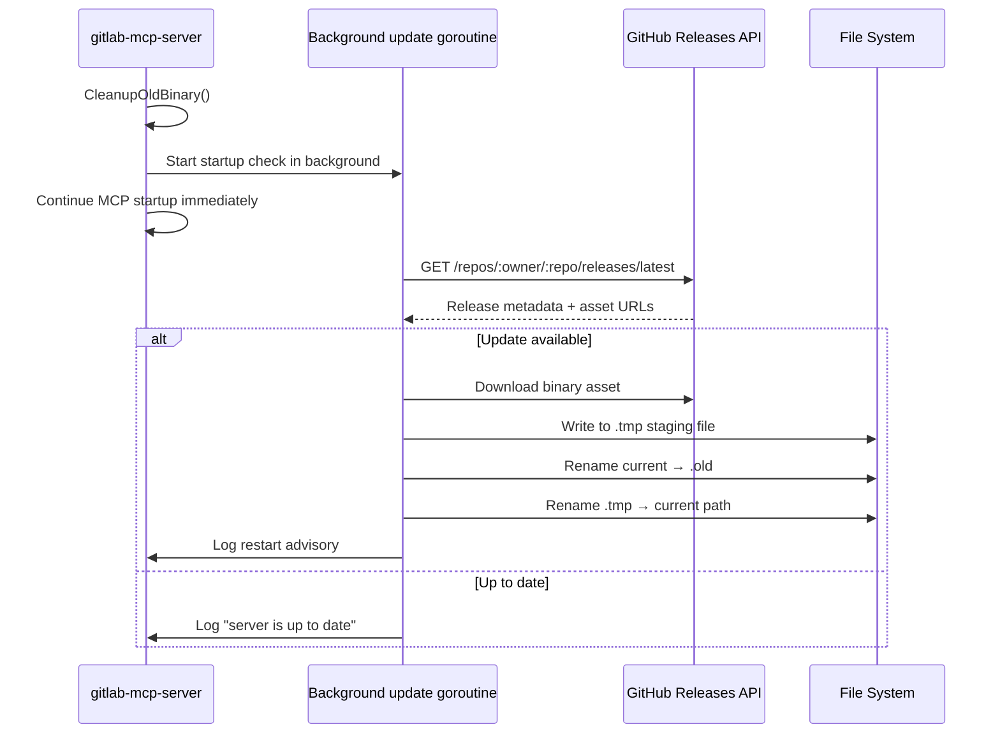

:::note[Developer Documentation]
For the complete technical reference, see [`docs/auto-update.md`](https://github.com/jmrplens/gitlab-mcp-server/blob/main/docs/auto-update.md) in the repository.
:::

GitLab MCP Server can automatically detect, download, and apply new releases from GitHub. Updates use a **rename trick** — the running binary is renamed to `.old` and the new binary is placed at the original path. The running MCP process keeps serving; restart it to use the new binary.

## Update modes

The `AUTO_UPDATE` variable controls how updates are handled:

| Value            | Mode        | Behavior                                              |
| ---------------- | ----------- | ----------------------------------------------------- |
| `true` (default) | Auto-apply  | Detect and apply updates automatically                |
| `check`          | Notify only | Detect updates and log availability, but do not apply |
| `false`          | Disabled    | Skip all update checks entirely                       |

Accepted aliases: `1`/`yes` for true, `0`/`no` for false. The value is case-insensitive.

## How it works



### Startup check (stdio mode)

In stdio mode (the default), auto-update runs as a **background startup check** with a configurable timeout (default: 60 seconds). MCP startup continues immediately while release detection and downloads run in the background:

1. `CleanupOldBinary()` removes any leftover `.old` file from a previous update
2. The server schedules the update check in a background goroutine
3. Checks for a newer release on GitHub without blocking MCP tool negotiation
4. If mode is `true` and a newer version exists, downloads and replaces the binary
5. Logs a restart advisory so the next server process uses the new version

The startup check is **non-blocking and non-fatal** — any error (network timeout, missing releases) is logged as a warning and does not prevent the server from starting or accepting MCP requests.

### Periodic check (HTTP mode)

In HTTP mode, auto-update runs as a **background periodic check**:

1. A goroutine checks for updates every `AUTO_UPDATE_INTERVAL` (default: 1 hour)
2. Each cycle checks GitHub for a newer release with a 30-second timeout
3. If mode is `true`, applies the update and logs a restart advisory
4. The goroutine stops when the server shuts down

## Configuration

### Environment variables (stdio mode)

| Variable               | Default                      | Description                                              |
| ---------------------- | ---------------------------- | -------------------------------------------------------- |
| `AUTO_UPDATE`          | `true`                       | Update mode: `true`, `check`, or `false`                 |
| `AUTO_UPDATE_REPO`     | `jmrplens/gitlab-mcp-server` | GitHub repository slug (`owner/repo`) for release assets |
| `AUTO_UPDATE_INTERVAL` | `1h`                         | Check interval (used by HTTP mode periodic checks)       |
| `AUTO_UPDATE_TIMEOUT`  | `60s`                        | Startup/background update timeout (range: 5s–10m)        |

### CLI flags (HTTP mode)

| Flag                     | Default                      | Description                                              |
| ------------------------ | ---------------------------- | -------------------------------------------------------- |
| `--auto-update`          | `true`                       | Update mode: `true`, `check`, or `false`                 |
| `--auto-update-repo`     | `jmrplens/gitlab-mcp-server` | GitHub repository slug (`owner/repo`) for release assets |
| `--auto-update-interval` | `1h`                         | Interval between periodic update checks                  |
| `--auto-update-timeout`  | `60s`                        | Startup/background update timeout (range: 5s–10m)        |

:::note
Auto-update uses the **GitHub Releases API** — it is completely independent of your GitLab configuration. Your `GITLAB_URL`, `GITLAB_TOKEN`, and `GITLAB_SKIP_TLS_VERIFY` settings do not affect auto-update.
:::

### Configuration examples

Disable auto-update entirely:

```ini
AUTO_UPDATE=false
```

Check-only mode (log availability but do not apply):

```ini
AUTO_UPDATE=check
```

Use a custom fork repository:

```ini
AUTO_UPDATE_REPO=my-org/my-gitlab-mcp-fork
```

## Shutdown flag for external updaters

External tools (such as pe-agnostic-store) can terminate all running instances before replacing the binary on disk:

```bash
gitlab-mcp-server --shutdown
```

This flag:

1. Finds all running `gitlab-mcp-server` processes by name
2. Sends a graceful termination signal
3. Waits up to 5 seconds for processes to exit
4. Force-kills any remaining processes
5. Exits — no MCP server is started

No admin or root permissions are required. This works on Linux, macOS, and Windows.

## Rollback

If an update causes issues:

1. The previous binary is preserved as `gitlab-mcp-server.old` (or `.exe.old` on Windows) next to the current binary
2. To rollback, stop the server and rename the `.old` file back to the original name
3. The `.old` file is automatically cleaned up on the next successful startup

## Custom repository support

You can point auto-update at any GitHub repository that follows the expected release format:

1. Set `AUTO_UPDATE_REPO=owner/repo` to your repository
2. Create GitHub releases with platform binaries named `gitlab-mcp-server-{os}-{arch}`
3. Include a `checksums.txt` asset with SHA-256 hashes (goreleaser format)

:::caution
Release asset names **must be exact filenames** (e.g., `gitlab-mcp-server-linux-amd64`). Never add descriptive suffixes like `(Linux AMD64)` — the update library matches by exact name and will fail with decorated names.
:::
