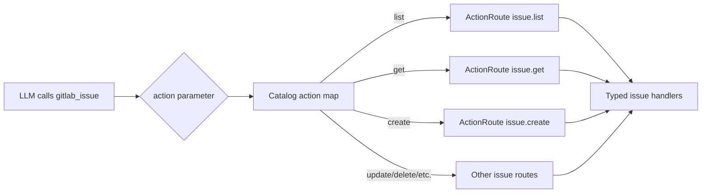

:::note[Developer Documentation]
For the complete technical reference, see [`docs/meta-tools.md`](https://github.com/jmrplens/gitlab-mcp-server/blob/main/docs/meta-tools.md) in the repository.
:::

Meta-tools are an explicit operating mode of GitLab MCP Server, enabled with `TOOL_SURFACE=meta`. Instead of exposing each GitLab API operation as a separate MCP tool, meta-tools **group related operations under a single tool** with an `action` parameter that dispatches to the correct handler.

## Why meta-tools?

LLMs have limited context windows. When an MCP server registers hundreds of individual tools (up to 1033 on GitLab.com Enterprise/Premium), the tool descriptions alone consume a large portion of the available tokens, leaving less room for the actual conversation.

| Mode              | Tool Count        | Token Overhead | Functionality           |
| ----------------- | ----------------- | -------------- | ----------------------- |
| Individual        | 867 / 1027 / 1033 | Very high      | Full                    |
| Meta (base)       | 33                | Low            | Full                    |
| Meta (enterprise) | 49 / 50           | Low            | Full + Premium/Ultimate |

Meta-tools reduce the tool count by **more than 95%** while preserving 100% of the functionality. Every individual tool operation is available as an action within one of the domain meta-tools.

The `gitlab_server` update helper can appear separately for server maintenance actions and is not included in the 33/49/50 GitLab action catalog counts.

:::note[Client compatibility]
Some AI clients impose tool count limits (e.g., JetBrains AI Assistant limits MCP servers to 100 tools). Meta-tool mode (33 base tools, 49 self-managed enterprise tools, or 50 GitLab.com Enterprise tools with Orbit) works within these constraints. If you select individual tools with `TOOL_SURFACE=individual`, clients with such limits will only see a subset of the complete individual tool set.
:::

## How meta-tools work

Each meta-tool defines an `action` enum that lists all available operations. The server validates the action and dispatches to the corresponding handler function internally.



The action parameter is always required and must be one of the enumerated values. Additional parameters depend on the chosen action.

## Discovering action parameters

Meta-tools use a common envelope:

```json
{
	"action": "create",
	"params": {
		"project_id": "42"
	}
}
```

By default, `META_PARAM_SCHEMA=opaque` keeps the tool schema small: clients see the valid `action` enum, while `params` remains an action-specific object. To discover the exact shape for a specific action, read the tool manifest resources:

| Resource              | Use                                                                                          |
| --------------------- | -------------------------------------------------------------------------------------------- |
| `gitlab://tools`      | Lists visible tools and executable entries for the active surface                            |
| `gitlab://tools/{id}` | Returns the accepted call shape and JSON Schema for one action, such as `gitlab_project.get` |

Example resource reads:

```json
{
	"method": "resources/read",
	"params": {
		"uri": "gitlab://tools"
	}
}
```

```json
{
	"method": "resources/read",
	"params": {
		"uri": "gitlab://tools/gitlab_merge_request.create"
	}
}
```

The per-action detail response includes the `params` schema and the final call shape. These resources remain available for meta-tools when `CAPABILITY_SURFACE=minimal` is enabled, while optional GitLab data resources, prompts, and workflow guides are omitted. Dynamic deployments can still use `gitlab_find_action` for inline schemas; meta-tool deployments can keep `META_PARAM_SCHEMA=opaque` and read `gitlab://tools/{id}` instead of inlining schemas in `tools/list`. Current audit metrics show `compact` is 6.5x larger than `opaque`, and `full` is 11.9x larger.

## Example usage

### Creating an issue

```json
{
	"tool": "gitlab_issue",
	"arguments": {
		"action": "create",
		"params": {
			"project_id": "my-group/my-project",
			"title": "Update API documentation",
			"description": "The REST API docs are missing the new v2 endpoints",
			"labels": "documentation,api",
			"assignee_ids": "42",
			"milestone_id": 7
		}
	}
}
```

### Listing merge requests

```json
{
	"tool": "gitlab_merge_request",
	"arguments": {
		"action": "list",
		"params": {
			"project_id": "my-group/my-project",
			"state": "opened",
			"order_by": "updated_at",
			"per_page": 20
		}
	}
}
```

### Searching Code

```json
{
	"tool": "gitlab_search",
	"arguments": {
		"action": "code",
		"params": {
			"search": "func handleWebhook",
			"project_id": "my-group/my-project"
		}
	}
}
```

### Checking Orbit availability

```json
{
	"tool": "gitlab_orbit",
	"arguments": {
		"action": "status",
		"params": {
			"response_format": "llm"
		}
	}
}
```

`gitlab_orbit` is registered only for GitLab.com Enterprise/Premium connections and exposes five read-only Knowledge Graph actions: `status`, `schema`, `tools`, `query`, and `graph_status`.

## Key meta-tools reference

### `gitlab_project`

Manages project lifecycle and configuration.

**Actions**: `list`, `get`, `create`, `update`, `delete`, `archive`, `unarchive`, `fork`, `star`, `unstar`, `transfer`, `languages`, `users`, `forks`, `starrers`, `hooks`, `create_hook`, `update_hook`, `delete_hook`

### `gitlab_issue`

Full issue lifecycle management including labels, assignees, and state transitions.

**Actions**: `list`, `get`, `create`, `update`, `delete`, `close`, `reopen`, `subscribe`, `unsubscribe`, `move`, `clone`, `add_label`, `remove_label`, `set_assignees`, `add_time_spent`, `reset_time_spent`, `set_time_estimate`, `reset_time_estimate`

### `gitlab_merge_request`

Complete merge request workflow from creation to merge.

**Actions**: `list`, `get`, `create`, `update`, `merge`, `close`, `reopen`, `rebase`, `approve`, `unapprove`, `subscribe`, `unsubscribe`, `add_label`, `remove_label`, `set_assignees`, `set_reviewers`, `add_time_spent`, `reset_time_spent`

### `gitlab_pipeline`

Pipeline management and monitoring.

**Actions**: `list`, `get`, `create`, `cancel`, `retry`, `delete`, `variables`, `test_report`, `bridges`, `wait`

### `gitlab_job`

CI/CD job management.

**Actions**: `list`, `get`, `play`, `cancel`, `retry`, `erase`, `trace`, `artifacts`, `download_artifact`, `delete_artifacts`, `delete_project_artifacts`, `wait`

### `gitlab_branch`

Branch operations.

**Actions**: `list`, `get`, `create`, `delete`, `merged`

### `gitlab_commit`

Commit operations and history.

**Actions**: `list`, `get`, `diff`, `refs`, `cherry_pick`, `revert`, `comments`, `create_comment`, `statuses`, `merge_requests`

### `gitlab_tag`

Tag management.

**Actions**: `list`, `get`, `create`, `delete`

### `gitlab_release`

Release lifecycle management.

**Actions**: `list`, `get`, `create`, `update`, `delete`, `evidences`

### `gitlab_label`

Label management for projects and groups.

**Actions**: `list`, `get`, `create`, `update`, `delete`, `subscribe`, `unsubscribe`

### `gitlab_milestone`

Milestone tracking.

**Actions**: `list`, `get`, `create`, `update`, `delete`, `issues`, `merge_requests`

### `gitlab_member`

Project and group membership.

**Actions**: `list`, `get`, `add`, `update`, `remove`, `all`

### `gitlab_group`

Group and subgroup management.

**Actions**: `list`, `get`, `create`, `update`, `delete`, `projects`, `subgroups`, `members`, `labels`, `milestones`, `hooks`

### `gitlab_search`

Cross-resource search across your GitLab instance.

**Actions**: `code`, `issues`, `merge_requests`, `commits`, `milestones`, `notes`, `projects`, `snippets`, `users`, `wiki`

### `gitlab_user`

User information and lookup.

**Actions**: `get`, `current`, `list`, `status`, `activities`

### `gitlab_wiki`

Wiki page management.

**Actions**: `list`, `get`, `create`, `update`, `delete`

### `gitlab_todo`

Personal todo/task list.

**Actions**: `list`, `mark_done`, `mark_all_done`

## Enterprise mode

The Enterprise/Premium catalog enables 16 additional meta-tools that expose GitLab Premium and Ultimate features. In stdio mode, set `GITLAB_ENTERPRISE=true`; in HTTP mode, use `--enterprise` to force the catalog or omit it to allow CE/EE auto-detection per token+URL entry. Additionally, enterprise-only action routes are added to existing base meta-tools:

- **Iterations** → routed through `gitlab_issue`
- **Project mirrors** → routed through `gitlab_project`
- **SSH certificates** → routed through `gitlab_group`
- **Security settings** → split between `gitlab_project` and `gitlab_group`
- **Group credentials** → routed through `gitlab_group`
- **Group analytics** → routed through `gitlab_group`

:::tip
You can check which tools your server has registered by looking at the startup log output or by calling the `tools/list` MCP method.
:::

## Configuration

| Variable             | Default  | Description                                                                                                                                                                  |
| -------------------- | -------- | ---------------------------------------------------------------------------------------------------------------------------------------------------------------------------- |
| `TOOL_SURFACE`       | `meta`   | Canonical selector for this mode: set `meta` to use meta-tools. Set `individual` only when you intentionally want one MCP tool per GitLab operation.                         |
| `META_TOOLS`         | legacy   | Deprecated compatibility selector: `true` maps to `meta`, and `false` maps to `individual` when `TOOL_SURFACE` is absent.                                                    |
| `CAPABILITY_SURFACE` | `full`   | Resource and prompt catalog selector: `full` or `minimal`. Minimal keeps `gitlab://workspace/roots` and `gitlab://tools`, and omits optional resources, guides, and prompts. |
| `META_PARAM_SCHEMA`  | `opaque` | Controls how much per-action `params` schema is inlined in `tools/list`: `opaque`, `compact`, or `full`. Exact action schemas are available through `gitlab://tools/{id}`.   |
| `GITLAB_ENTERPRISE`  | `false`  | Enable enterprise-only meta-tools in stdio mode (requires Premium/Ultimate).                                                                                                 |
| `--enterprise`       | `false`  | In HTTP mode, force enterprise-only meta-tools; omit to auto-detect CE/EE per token+URL entry.                                                                               |
